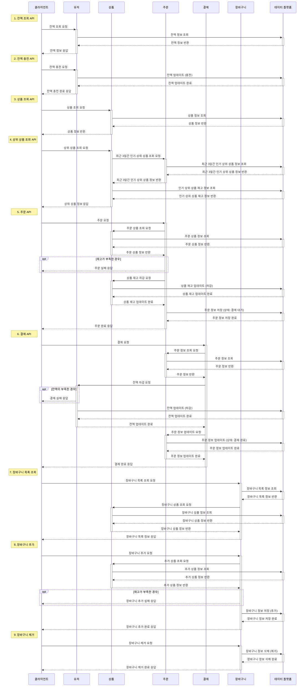
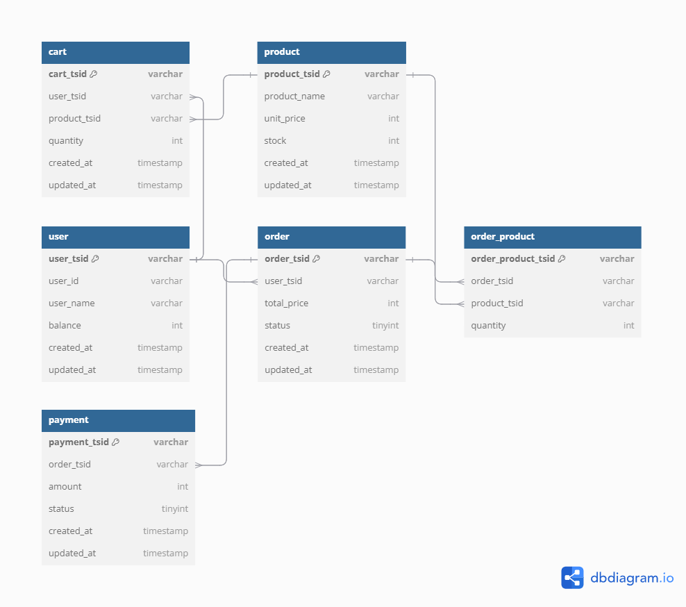
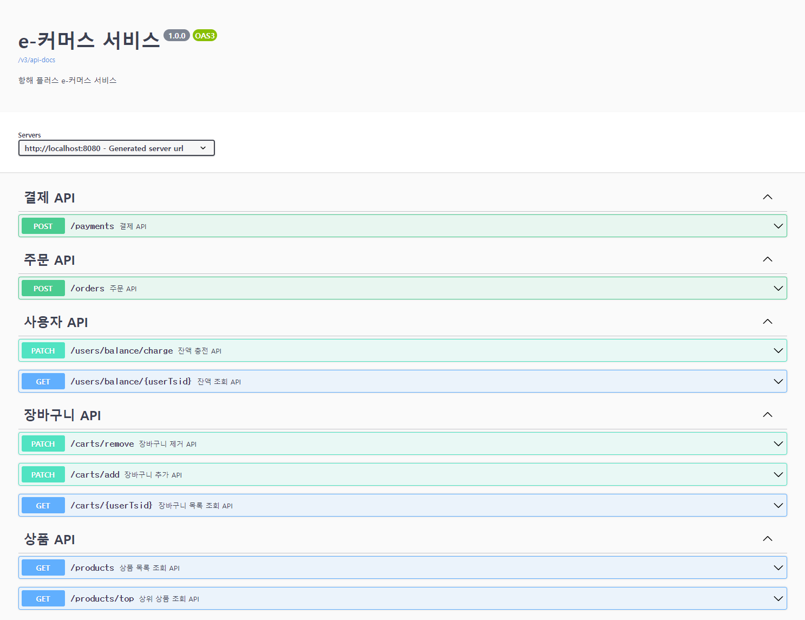

# 항해 플러스 3주차. e-커머스

## 프로젝트 정보
- Java 17
- SpringBoot 3.3.4
- JUnit + AssertJ
- Layered + Clean Architecture
- Swagger (http://localhost:8080/swagger-ui/index.html)

## 목차

### `Step05`
1. [시나리오 선정](#1-시나리오-선정-e-커머스-서비스)
2. [Milestone](#2-Milestone)
3. [시퀀스 다이어그램](#3-시퀀스-다이어그램)

### `Step06`
1. [ERD 설계](#1-erd-설계)
2. [API 명세 및 MockAPI](#2-api-명세-및-mockapi)

---

## `Step5`
## 1. 시나리오 선정: `e-커머스 서비스`
<details>
<summary>요구사항 보기</summary>

### Description
- `e-커머스 상품 주문 서비스`를 구현해 봅니다.
- 상품 주문에 필요한 메뉴 정보들을 구성하고 조회가 가능해야 합니다.
- 사용자는 상품을 여러개 선택해 주문할 수 있고, 미리 충전한 잔액을 이용합니다.
- 상품 주문 내역을 통해 판매량이 가장 높은 상품을 추천합니다.

### Requirements
- 아래 4가지 API 를 구현합니다.
    - 잔액 충전 / 조회 API
    - 상품 조회 API
    - 주문 / 결제 API
    - 인기 판매 상품 조회 API
- 각 기능 및 제약사항에 대해 단위 테스트를 반드시 하나 이상 작성하도록 합니다.
- 다수의 인스턴스로 어플리케이션이 동작하더라도 기능에 문제가 없도록 작성하도록 합니다.
- `동시성 이슈`를 고려하여 구현합니다.
- 재고 관리에 문제 없도록 구현합니다.

### API Specs

`기본 과제`

1️⃣ `주요` 잔액 충전 / 조회 API
- 결제에 사용될 금액을 충전하는 API 를 작성합니다.
- 사용자 식별자 및 충전할 금액을 받아 잔액을 충전합니다.
- 사용자 식별자를 통해 해당 사용자의 잔액을 조회합니다.

2️⃣ `기본` 상품 조회 API
- 상품 정보(ID, 이름, 가격, 잔여수량)을 조회하는 API 를 작성합니다.
- 조회 시점의 상품별 잔여수량이 정확하면 좋습니다.

3️⃣ `주요` 주문 / 결제 API
- 사용자 식별자와 (상품 ID, 수량) 목록을 입력받아 주문하고 결제를 수행하는 API 를 작성합니다.
- 결제는 기 충전된 잔액을 기반으로 수행하며 성공할 시 잔액을 차감해야 합니다.
- 데이터 분석을 위해 결제 성공 시에 실시간으로 주문 정보를 데이터 플랫폼에 전송해야 합니다.
  - 데이터 플랫폼이 어플리케이션 `외부` 라는 가정만 지켜 작업해 주시면 됩니다.
  - 데이터 플랫폼으로의 전송 기능은 Mock API, Fake Module 등 다양한 방법으로 접근해 봅니다.

4️⃣ `기본` 상위 상품 조회 API
- 최근 3일간 가장 많이 팔린 상위 5개 상품 정보를 제공하는 API 를 작성합니다.
- 통계 정보를 다루기 위한 기술적 고민을 충분히 해보도록 합니다.

`심화 과제`

5️⃣ `심화` 장바구니 기능
- 사용자는 구매 이전에 관심 있는 상품들을 장바구니에 적재할 수 있습니다.
- 이 기능을 제공하기 위해 `장바구니에 상품 추가/삭제` API 와 `장바구니 조회` API 가 필요합니다.
- 위 두 기능을 제공하기 위해 어떤 요구사항의 비즈니스 로직을 설계해야 할지 고민해 봅니다.

`💡KEY POINT`

- 동시에 여러 주문이 들어올 경우, 유저의 보유 잔고에 대한 처리가 정확해야 합니다.
- 각 상품의 재고 관리가 정상적으로 이루어져 잘못된 주문이 발생하지 않도록 해야 합니다.

</details>

## 2. Milestone
<details>
<summary>내용 보기</summary>

### 1주차 (2024년 10월 05일 ~ 2024년 10월 11일)
- `주요 목표`: 프로젝트 시작 및 기본 API 설계
- `작업 내용`
  - Milestone 작성
  - 시퀀스 다이어그램 작성
  - ERD 작성
  - API 명세 및 MockAPI 작성

### 2주차 (2024년 10월 12일 ~ 2024년 10월 18일)
- `주요 목표`: 기능 구현
- `작업 내용`
  - 잔액 충전 / 조회 API 구현
  - 상품 조회 API / 상위 상품 조회 API 구현
  - 주문 / 결제 API 구현
  - 장바구니 기능 구현

### 3주차 (2024년 10월 19일 ~ 2024년 10월 25일)
- `주요 목표`: 기능 고도화 및 리팩토링
- `작업 내용`
  - 코드 리팩토링 및 최적화
  - 예외 처리 강화
  - 통합 테스트 작성

</details>

## 3. 시퀀스 다이어그램
<details>
<summary>내용 보기</summary>

### ver. 1주차 (2024년 10월 05일 ~ 2024년 10월 11일)
- 클라이언트, 도메인 모듈, 데이터 플랫폼을 기본 구조로 시퀀스 다이어그램을 작성 
- 추후 과제 요구사항에 맞춰 점차 고도화 예정
- Mermaid 로딩 문제로 인한 다이어그램 통합


</details>

## `Step6`

## 1. ERD 설계

<details>
<summary>내용 보기</summary>

### ver. 1주차 (2024년 10월 05일 ~ 2024년 10월 11일)
- 히스토리 테이블 제외
- 추후 과제 요구사항에 맞춰 점차 고도화 예정



</details>

## 2. API 명세 및 MockAPI

<details>
<summary>내용 보기</summary>

## MockAPI

`Swagger`: http://localhost:8080/swagger-ui/index.html



## API 명세

### (1) 잔액 조회 API
- Endpoint: `GET` /users/balance/{userTsid}
- Summary: 사용자의 잔액을 조회한다.
- Parameter:
  - `userTsid` 사용자 식별 ID
- ResponseBody:
  - `200` OK
    - `userTsid`: 사용자 식별 ID
    - `balance`: 잔액
  ```json
  {
    "userTsid": "string",
    "balance": "long"
  }
  ```
- Example:
  - Response:
    ```json
    {
      "userTsid": "U001",
      "balance": 1000000
    }
    ```
    
### (2) 잔액 충전 API
- Endpoint: `PATCH` /users/balance/charge
- Summary: 사용자의 잔액을 충전한다.
- RequestBody:
  - `userTsid`: 사용자 식별 ID
  - `amount`: 충전할 금액
  ```json
  {
    "userTsid": "string",
    "amount": "long"
  }
  ```
- ResponseBody:
  - `200` OK
    - `userTsid`: 사용자 식별 ID
    - `balance`: 잔액
    ```json
    {
      "userTsid": "string",
      "balance": "long"
    }
    ```
- Example:
  - Request:
    ```json
    {
      "userTsid": "U001",
      "amount": 500000
    }
    ``` 
  - Response:
    ```json
    {
      "userTsid": "U001",
      "balance": 1500000
    }
    ```

### (3) 상품 목록 조회 API
- Endpoint: `GET` /products
- Summary: 상품 목록을 조회한다.
- ResponseBody:
  - `200` OK
    - `productTsid`: 상품 식별 ID
    - `productName`: 상품명
    - `unitPrice`: 단가
    - `stock`: 재고 수량
  ```json
  [
    {
      "productTsid": "String",
      "productName": "String",
      "unitPrice": "Integer",
      "stock": "Integer"
    }
  ]
  ```
- Example:
  - Response:
    ```json
    [
      {
        "productTsid": "P001",
        "productName": "키보드",
        "unitPrice": 100000,
        "stock": 100
      },
      {
        "productTsid": "P002",
        "productName": "마우스",
        "unitPrice": 50000,
        "stock": 500
      },
      {
        "productTsid": "P003",
        "productName": "모니터",
        "unitPrice": 300000,
        "stock": 90
      },
      {
        "productTsid": "P004",
        "productName": "헤드셋",
        "unitPrice": 150000,
        "stock": 200
      },
      {
        "productTsid": "P005",
        "productName": "노트북",
        "unitPrice": 1000000,
        "stock": 30
      },
      {
        "productTsid": "P006",
        "productName": "태블릿",
        "unitPrice": 250000,
        "stock": 40
      },
      {
        "productTsid": "P007",
        "productName": "데스크톱",
        "unitPrice": 2000000,
        "stock": 10
      }
    ]
    ```

### (4) 상위 상품 조회 API
- Endpoint: `GET` /products/top
- Summary: 최근 3일간 가장 많이 팔린 상위 5개 상품을 조회한다.
- ResponseBody:
  - `200` OK
    - `productTsid`: 상품 식별 ID
    - `productName`: 상품명
    - `unitPrice`: 단가
    - `stock`: 재고 수량
  ```json
  [
    {
      "productTsid": "String",
      "productName": "String",
      "unitPrice": "Integer",
      "stock": "Integer"
    }
  ]
  ```
- Example:
  - Response:
    ```json
    [
      {
        "productTsid": "P001",
        "productName": "키보드",
        "unitPrice": 100000,
        "stock": 100
      },
      {
        "productTsid": "P002",
        "productName": "마우스",
        "unitPrice": 50000,
        "stock": 500
      },
      {
        "productTsid": "P003",
        "productName": "모니터",
        "unitPrice": 300000,
        "stock": 90
      },
      {
        "productTsid": "P004",
        "productName": "헤드셋",
        "unitPrice": 150000,
        "stock": 200
      },
      {
        "productTsid": "P005",
        "productName": "노트북",
        "unitPrice": 1000000,
        "stock": 30
      }
    ]
    ```

### (5) 주문 API
- Endpoint: `POST` /orders
- Summary: 상품을 주문한다.
- RequestBody:
  - `userTsid`: 사용자 식별 ID
  - `productList`: 주문 상품 리스트
    - `productTsid`: 상품 식별 ID
    - `quantity`: 주문 수량 
  ```json
  {
    "userTsid": "String",
    "productList": [
      {
        "productTsid" : "String",
        "quantity" : "Integer"
      }
    ]
  }
  ```
- ResponseBody:
  - `200` OK
    - `orderTsid`: 주문 식별 ID
    - `totalPrice`: 주문 금액 합계
    - `status`: 주문 상태 (0: 주문 취소, 1: 결제 대기, 2: 결제 완료)
    - `productList`: 주문 상품 리스트
      - `productTsid`: 상품 식별 ID
      - `productName`: 상품명
      - `quantity`: 주문 수량
      - `unitPrice`: 단가
    ```json
    {
      "orderTsid": "String",
      "totalPrice" : "Integer",
      "status" : "Integer",
      "productList": [
        {
          "productTsid" : "String",
          "productName" : "String",
          "quantity" : "Integer",
          "unitPrice" : "Integer"
        }
      ]
    }
    ```
- Example:
  - Request:
    ```json
    {
      "userTsid": "U001",
      "productList": [
        {
          "productTsid": "P001",
          "quantity": 1
        },
        {
          "productTsid": "P002",
          "quantity": 3
        }
      ]
    }
    ``` 
  - Response:
    ```json
    {
      "orderTsid": "O001",
      "totalPrice": 250000,
      "status": 1,
      "productList": [
        {
          "productTsid": "P001",
          "productName": "키보드",
          "quantity": 1,
          "unitPrice": 100000
        },
        {
          "productTsid": "P002",
          "productName": "마우스",
          "quantity": 3,
          "unitPrice": 50000
        }
      ]
    }
    ```

### (6) 결제 API
- Endpoint: `POST` /payments
- Summary: 주문을 결제한다.
- RequestBody:
  - `userTsid`: 사용자 식별 ID
  - `orderTsid`: 주문 식별 ID
  ```json
  {
    "userTsid": "String",
    "orderTsid": "String"
  }
  ```
- ResponseBody:
  - `200` OK
    - `paymentTsid`: 결제 식별 ID
    - `amount`: 결제 금액
    - `status`: 결제 상태 (0: 결제 취소, 1: 결제 완료)
    ```json
    {
      "paymentTsid": "String",
      "amount" : "Integer",
      "status" : "Integer"
    }
    ```
- Example:
  - Request:
    ```json
    {
      "userTsid": "U001",
      "orderTsid": "O001"
    }
    ``` 
  - Response:
    ```json
    {
      "orderTsid": "O001",
      "amount": 250000,
      "status": 1
    }
    ```

### (7) 장바구니 목록 조회 API
- Endpoint: `GET` /carts/{userTsid}
- Summary: 장바구니 목록을 조회한다.
- Parameter:
  - `userTsid` 사용자 식별 ID
- ResponseBody:
  - `200` OK
    - `cartTsid`: 장바구니 식별 ID
    - `productTsid`: 상품 식별 ID
    - `productName`: 상품명
    - `quantity`: 장바구니 상품 수량
    - `unit_price`: 단가
  ```json
  [
    {
      "cartTsid": "String",
      "productTsid": "String",
      "productName": "String",
      "quantity": "Integer",
      "unit_price": "Integer"
    }
  ]
  ```
- Example:
  - Response:
    ```json
    [
      {
        "cartTsid": "C001",
        "productTsid": "P001",
        "productName": "키보드",
        "quantity": 1,
        "unit_price": 120000
      },
      {
        "cartTsid": "C003",
        "productTsid": "P003",
        "productName": "해드셋",
        "quantity": 2,
        "unit_price": 80000
      }
    ]
    ```

### (8) 장바구니 추가 API
- Endpoint: `PATCH` /carts/add
- Summary: 장바구니에 상품을 추가한다.
- RequestBody:
  - `userTsid`: 사용자 식별 ID
  - `productTsid`: 상품 식별 ID
  - `quantity`: 추가 수량
  ```json
  {
    "userTsid": "String",
    "productTsid": "String",
    "quantity": "Integer"
  }
  ```
- ResponseBody:
  - `200` OK
    - `cartTsid`: 장바구니 식별 ID
    - `productTsid`: 상품 식별 ID
    - `productName`: 상품명
    - `quantity`: 장바구니 상품 수량
    - `unit_price`: 단가
  ```json
  [
    {
      "cartTsid": "String",
      "productTsid": "String",
      "productName": "String",
      "quantity": "Integer",
      "unit_price": "Integer"
    }
  ]
  ```
- Example:
  - Request:
    ```json
    {
      "userTsid": "U001",
      "productTsid": "P002",
      "quantity": 4
    }
    ``` 
  - Response:
    ```json
    [
      {
        "cartTsid": "C001",
        "productTsid": "P001",
        "productName": "키보드",
        "quantity": 1,
        "unit_price": 120000
      },
      {
        "cartTsid": "C002",
        "productTsid": "P002",
        "productName": "마우스",
        "quantity": 4,
        "unit_price": 50000
      },
      {
        "cartTsid": "C003",
        "productTsid": "P003",
        "productName": "해드셋",
        "quantity": 2,
        "unit_price": 80000
      }
    ]
    ```
    
### (9) 장바구니 제거 API
- Endpoint: `PATCH` /carts/remove
- Summary: 장바구니의 상품을 제거한다.
- RequestBody:
  - `userTsid`: 사용자 식별 ID
  - `cartTsid`: 장바구니 식별 ID
  ```json
  {
    "userTsid": "String",
    "cartTsid": "String"
  }
  ```
- ResponseBody:
  - `200` OK
    - `cartTsid`: 장바구니 식별 ID
    - `productTsid`: 상품 식별 ID
    - `productName`: 상품명
    - `quantity`: 장바구니 상품 수량
    - `unit_price`: 단가
  ```json
  [
    {
      "cartTsid": "String",
      "productTsid": "String",
      "productName": "String",
      "quantity": "Integer",
      "unit_price": "Integer"
    }
  ]
  ```
- Example:
  - Request:
    ```json
    {
      "userTsid": "U001",
      "cartTsid": "C003"
    }
    ``` 
  - Response:
    ```json
    [
      {
        "cartTsid": "C001",
        "productTsid": "P001",
        "productName": "키보드",
        "quantity": 1,
        "unit_price": 120000
      },
      {
        "cartTsid": "C002",
        "productTsid": "P002",
        "productName": "마우스",
        "quantity": 4,
        "unit_price": 50000
      }
    ]
    ```
    
</details>