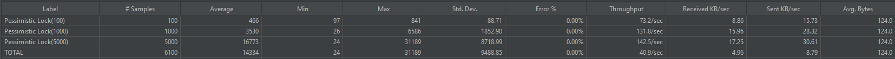
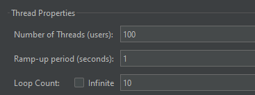

# 항해 플러스 3주차. e-커머스

## 프로젝트 정보
- Java 17
- SpringBoot 3.3.4
- JUnit + AssertJ
- Layered + Clean Architecture
- MySQL 8.0
- Swagger (http://localhost:8080/swagger-ui/index.html)

## `Step5`
## 시나리오 선정: `e-커머스 서비스`
<details>
<summary>요구사항 보기</summary>

### Description
- `e-커머스 상품 주문 서비스`를 구현해 봅니다.
- 상품 주문에 필요한 메뉴 정보들을 구성하고 조회가 가능해야 합니다.
- 사용자는 상품을 여러개 선택해 주문할 수 있고, 미리 충전한 잔액을 이용합니다.
- 상품 주문 내역을 통해 판매량이 가장 높은 상품을 추천합니다.

### Requirements
- 아래 4가지 API 를 구현합니다.
    - 잔액 충전 / 조회 API
    - 상품 조회 API
    - 주문 / 결제 API
    - 인기 판매 상품 조회 API
- 각 기능 및 제약사항에 대해 단위 테스트를 반드시 하나 이상 작성하도록 합니다.
- 다수의 인스턴스로 어플리케이션이 동작하더라도 기능에 문제가 없도록 작성하도록 합니다.
- `동시성 이슈`를 고려하여 구현합니다.
- 재고 관리에 문제 없도록 구현합니다.

### API Specs

`기본 과제`

1️⃣ `주요` 잔액 충전 / 조회 API
- 결제에 사용될 금액을 충전하는 API 를 작성합니다.
- 사용자 식별자 및 충전할 금액을 받아 잔액을 충전합니다.
- 사용자 식별자를 통해 해당 사용자의 잔액을 조회합니다.

2️⃣ `기본` 상품 조회 API
- 상품 정보(ID, 이름, 가격, 잔여수량)을 조회하는 API 를 작성합니다.
- 조회 시점의 상품별 잔여수량이 정확하면 좋습니다.

3️⃣ `주요` 주문 / 결제 API
- 사용자 식별자와 (상품 ID, 수량) 목록을 입력받아 주문하고 결제를 수행하는 API 를 작성합니다.
- 결제는 기 충전된 잔액을 기반으로 수행하며 성공할 시 잔액을 차감해야 합니다.
- 데이터 분석을 위해 결제 성공 시에 실시간으로 주문 정보를 데이터 플랫폼에 전송해야 합니다.
  - 데이터 플랫폼이 어플리케이션 `외부` 라는 가정만 지켜 작업해 주시면 됩니다.
  - 데이터 플랫폼으로의 전송 기능은 Mock API, Fake Module 등 다양한 방법으로 접근해 봅니다.

4️⃣ `기본` 상위 상품 조회 API
- 최근 3일간 가장 많이 팔린 상위 5개 상품 정보를 제공하는 API 를 작성합니다.
- 통계 정보를 다루기 위한 기술적 고민을 충분히 해보도록 합니다.

`심화 과제`

5️⃣ `심화` 장바구니 기능
- 사용자는 구매 이전에 관심 있는 상품들을 장바구니에 적재할 수 있습니다.
- 이 기능을 제공하기 위해 `장바구니에 상품 추가/삭제` API 와 `장바구니 조회` API 가 필요합니다.
- 위 두 기능을 제공하기 위해 어떤 요구사항의 비즈니스 로직을 설계해야 할지 고민해 봅니다.

`💡KEY POINT`

- 동시에 여러 주문이 들어올 경우, 유저의 보유 잔고에 대한 처리가 정확해야 합니다.
- 각 상품의 재고 관리가 정상적으로 이루어져 잘못된 주문이 발생하지 않도록 해야 합니다.

</details>

## Milestone
<details>
<summary>내용 보기</summary>

### 1주차 (2024년 10월 05일 ~ 2024년 10월 11일)
- `주요 목표`: 프로젝트 시작 및 기본 API 설계
- `작업 내용`
  - Milestone 작성
  - 시퀀스 다이어그램 작성
  - ERD 작성
  - API 명세 및 MockAPI 작성

### 2주차 (2024년 10월 12일 ~ 2024년 10월 18일)
- `주요 목표`: 기능 구현
- `작업 내용`
  - 잔액 충전 / 조회 API 구현
  - 상품 조회 API / 상위 상품 조회 API 구현
  - 주문 / 결제 API 구현
  - 장바구니 기능 구현

### 3주차 (2024년 10월 19일 ~ 2024년 10월 25일)
- `주요 목표`: 기능 고도화 및 리팩토링
- `작업 내용`
  - 코드 리팩토링 및 최적화
  - 예외 처리 강화
  - 통합 테스트 작성

</details>

## 시퀀스 다이어그램
<details>
<summary>내용 보기</summary>

### ver. 1주차 (2024년 10월 05일 ~ 2024년 10월 11일)
- 클라이언트, 도메인 모듈, 데이터 플랫폼을 기본 구조로 시퀀스 다이어그램을 작성 
- 추후 과제 요구사항에 맞춰 점차 고도화 예정
- Mermaid 로딩 문제로 인한 다이어그램 통합

### ver. 2주차 (2024년 10월 12일 ~ 2024년 10월 18일)
- 과제 피드백 수정 사항 반영: 서비스명 및 메서드명 표기
- 비지니스 로직 구현에 따른 변경


</details>

## `Step6`

## ERD 설계

<details>
<summary>내용 보기</summary>

### ver. 1주차 (2024년 10월 05일 ~ 2024년 10월 11일)
- 히스토리 테이블 제외
- 추후 과제 요구사항에 맞춰 점차 고도화 예정

### ver. 2주차 (2024년 10월 12일 ~ 2024년 10월 18일)
- 과제 피드백 수정 사항 반영


</details>

## API 명세 및 MockAPI

<details>
<summary>내용 보기</summary>

### (1) 잔액 조회 API
- Endpoint: `GET` /users/balance/{id}
- Summary: 사용자의 잔액을 조회한다.
- Parameter:
  - `id` 사용자 고유 식별자
- ResponseBody:
  - `200` OK
    - `userId`: 사용자 고유 식별자
    - `userName`: 사용자 이름
    - `point`: 포인트 잔액
  ```json
  {
    "userId": "long",
    "userName": "string",
    "point": "long"
  }
  ```
- Example:
  - Response:
    ```json
    {
      "userId": 1,
      "userName": "Alice",
      "point": 100000
    }
    ```
    
### (2) 잔액 충전 API
- Endpoint: `PATCH` /users/balance/charge
- Summary: 사용자의 잔액을 충전한다.
- RequestBody:
  - `userId`: 사용자 고유 식별자
  - `amount`: 충전할 금액
  ```json
  {
    "userId": "long",
    "amount": "long"
  }
  ```
- ResponseBody:
  - `200` OK
    - `userId`: 사용자 고유 식별자
    - `userName`: 사용자 이름
    - `point`: 포인트 잔액
  ```json
  {
    "userId": "long",
    "userName": "string",
    "point": "long"
  }
  ```
- Example:
  - Request:
    ```json
    {
      "userId": 1,
      "amount": 500000
    }
    ``` 
  - Response:
    ```json
    {
       "userId": 1,
       "userName": "Alice",
       "point": 150000
    }
    ```

### (3) 상품 목록 조회 API
- Endpoint: `GET` /products
- Summary: 상품 목록을 조회한다.
- ResponseBody:
  - `200` OK
    - `productId`: 상품 고유 식별자
    - `productName`: 상품명
    - `unitPrice`: 단가
    - `stock`: 재고 수량
  ```json
  [
    {
      "productId": "long",
      "ProductName": "string",
      "unitPrice": "long",
      "stock": "long"
    }
  ]
  ```
- Example:
- Response:
  ```json
  [
    {
      "productId": 1,
      "ProductName": "Laptop",
      "unitPrice": 1500000,
      "stock": 10
    },
    {
      "productId": 2,
      "ProductName": "Smartphone",
      "unitPrice": 800000,
      "stock": 20
    },
    {
      "productId": 3,
      "ProductName": "Headphones",
      "unitPrice": 150000,
      "stock": 50
    },
    {
      "productId": 4,
      "ProductName": "Keyboard",
      "unitPrice": 50000,
      "stock": 30
    },
    {
      "productId": 5,
      "ProductName": "Mouse",
      "unitPrice": 30000,
      "stock": 40
    },
    {
      "productId": 6,
      "ProductName": "Monitor",
      "unitPrice": 300000,
      "stock": 15
    },
    {
      "productId": 7,
      "ProductName": "Tablet",
      "unitPrice": 600000,
      "stock": 25
    },
    {
      "productId": 8,
      "ProductName": "Smartwatch",
      "unitPrice": 250000,
      "stock": 35
    },
    {
      "productId": 9,
      "ProductName": "External Hard Drive",
      "unitPrice": 120000,
      "stock": 20
    },
    {
      "productId": 10,
      "ProductName": "USB Cable",
      "unitPrice": 10000,
      "stock": 100
    }
  ]
  ```

### (4) 상위 상품 조회 API
- Endpoint: `GET` /products/popular
- Summary: 최근 3일간 가장 많이 팔린 상위 5개 상품을 조회한다.
- ResponseBody:
  - `200` OK
    - `productId`: 상품 고유 식별자
    - `productName`: 상품명
    - `unitPrice`: 단가
    - `stock`: 재고 수량
  ```json
  [
    {
      "productId": "long",
      "ProductName": "string",
      "unitPrice": "long",
      "stock": "long"
    }
  ]
  ```
- Example:
  - Response:
    ```json
    [
      {
        "productId": 4,
        "ProductName": "Keyboard",
        "unitPrice": 50000,
        "stock": 30
      },
      {
        "productId": 2,
        "ProductName": "Smartphone",
        "unitPrice": 800000,
        "stock": 20
      },
      {
        "productId": 1,
        "ProductName": "Laptop",
        "unitPrice": 1500000,
        "stock": 10
      },
      {
        "productId": 7,
        "ProductName": "Tablet",
        "unitPrice": 600000,
        "stock": 25
      },
      {
        "productId": 10,
        "ProductName": "USB Cable",
        "unitPrice": 10000,
        "stock": 100
      }
    ]
    ```

### (5) 주문 API
- Endpoint: `POST` /orders
- Summary: 상품을 주문한다.
- RequestBody:
  - `userId`: 사용자 고유 식별자
  - `OrderProductList`: 주문 상품 리스트
    - `productId`: 상품 고유 식별자
    - `quantity`: 주문 수량 
  ```json
  {
    "userId": "long",
    "OrderProductList": [
      {
        "productId": "long",
        "quantity": "long"
      }
    ]
  }
  ```
- ResponseBody:
  - `200` OK
    - `orderId`: 주문 고유 식별자
    - `orderStatus`: 주문 상태 (PENDING: 주문 대기, COMPLETED: 주문 완료, CANCELED: 주문 취소)
    - `productCount`: 주문 상품 수량
    - `totalPrice`: 주문 금액
    ```json
    {
      "orderId": "long",
      "orderStatus": "string",
      "productCount": "long",
      "totalPrice": "long"
    }
    ```
- Example:
  - Request:
    ```json
    {
      "userId":1,
      "OrderProductList": [
        {
          "productId": 2,
          "quantity": 3
        }
      ]
    }
    ``` 
  - Response:
    ```json
    {
      "orderId": 11,
      "orderStatus": "PENDING",
      "productCount": 1,
      "totalPrice": 2400000
    }
    ```

### (6) 결제 API
- Endpoint: `POST` /payments
- Summary: 주문을 결제한다.
- RequestBody:
  - `userId`: 사용자 고유 식별자
  - `orderId`: 주문 고유 식별자
  ```json
  {
    "userId": "long",
    "orderId": "long"
  }
  ```
- ResponseBody:
  - `200` OK
    - `paymentTsid`: 결제 고유 식별자
    - `amount`: 결제 금액
    - `status`: 결제 상태 (SUCCESS: 결제 성공, FAILED: 결제 실패, CANCELLED: 결제 취소)
    ```json
    {
      "paymentId": "long",
      "amount" : "long",
      "paymentStatus" : "string"
    }
    ```
- Example:
  - Request:
    ```json
    {
      "userId": 1,
      "orderId": 11
    }
    ``` 
  - Response:
    ```json
    {
      "paymentId": 1,
      "amount": 2400000,
      "paymentStatus": "FAILED"
    }
    ```

### (7) 장바구니 목록 조회 API
- Endpoint: `GET` /carts/{id}
- Summary: 장바구니 목록을 조회한다.
- Parameter:
  - `id` 사용자 고유 식별자
- ResponseBody:
  - `200` OK
    - `productId`: 장바구니 고유 식별자
    - `productName`: 상품명
    - `quantity`: 장바구니 상품 수량
    - `unitPrice`: 장바구니 상품 단가
    - `cartState`: 장바구니 상품 상태 (AVAILABLE: 구매 가능, OUT_OF_STOCK: 품절)
  ```json
  [
    {
      "productId": "long",
      "productName": "string",
      "quantity": "long",
      "unitPrice": "long",
      "cartState": "string"
    }
  ]
  ```
- Example:
  - Response:
    ```json
    [
      {
        "productId": 1,
        "productName": "Laptop",
        "quantity": 1,
        "unitPrice": 1500000,
        "cartState": "AVAILABLE"
      }
    ]
    ```

### (8) 장바구니 추가 API
- Endpoint: `PATCH` /carts/add
- Summary: 장바구니에 상품을 추가한다.
- RequestBody:
  - `userId`: 사용자 고유 식별자
  - `productId`: 상품 고유 식별자
  - `quantity`: 장바구니 상품 추가 수량
  ```json
  {
    "userId": "long",
    "productId": "long",
    "quantity": "long"
  }
  ```
- ResponseBody:
  - `200` OK
    - `productId`: 장바구니 고유 식별자
    - `productName`: 상품명
    - `quantity`: 장바구니 상품 수량
    - `unitPrice`: 장바구니 상품 단가
    - `cartState`: 장바구니 상품 상태 (AVAILABLE: 구매 가능, OUT_OF_STOCK: 품절)
  ```json
  [
    {
      "productId": "long",
      "productName": "string",
      "quantity": "long",
      "unitPrice": "long",
      "cartState": "string"
    }
  ]
  ```
- Example:
  - Request:
    ```json
    {
      "userId": 1,
      "productId": 1,
      "quantity": 1
    }
    ``` 
  - Response:
    ```json
    [
      {
        "productId": 1,
        "productName": "Laptop",
        "quantity": 1,
        "unitPrice": 1500000,
        "cartState": "AVAILABLE"
      }
    ]
    ```
    
### (9) 장바구니 제거 API
- Endpoint: `PATCH` /carts/remove
- Summary: 장바구니의 상품을 제거한다.
- RequestBody:
  - `userId`: 사용자 고유 식별자
  - `productId`: 상품 고유 식별자
  ```json
  {
    "userId": "long",
    "productId": "long"
  }
  ```
- ResponseBody:
  - `200` OK
    - `productId`: 장바구니 고유 식별자
    - `productName`: 상품명
    - `quantity`: 장바구니 상품 수량
    - `unitPrice`: 장바구니 상품 단가
    - `cartState`: 장바구니 상품 상태 (AVAILABLE: 구매 가능, OUT_OF_STOCK: 품절)
  ```json
  [
    {
      "productId": "long",
      "productName": "string",
      "quantity": "long",
      "unitPrice": "long",
      "cartState": "string"
    }
  ]
  ```
- Example:
  - Request:
    ```json
    {
      "userId": 1,
      "productId": 1
    }
    ``` 
  - Response:
    ```json
    [
      {
        "productId": 1,
        "productName": "Laptop",
        "quantity": 1,
        "unitPrice": 1500000,
        "cartState": "AVAILABLE"
      }
    ]
    ```
    
</details>

## `Step7`
## Swagger
<details>
<summary>내용 보기</summary>

### Swagger: http://localhost:8080/swagger-ui/index.html


</details>

## `Step9`
## Chapter02 회고
<details>
<summary>내용 보기</summary>

### 1주차 (2024년 10월 05일 ~ 2024년 10월 11일)
프로젝트의 첫 주는 전체적인 방향을 잡는 데 중점을 두었습니다.
시퀀스 다이어그램과 ERD 작성은 비즈니스 로직을 시각적으로 표현하는 데 도움이 되었으며, 명세와 MockAPI 작성을 통해 각 엔드포인트의 역할을 명확히 할 수 있었습니다.
이 과정에서 느낀 점은 초기 설계에 시간을 투자하는 것이 이후 개발의 효율성을 높인다는 것이었습니다. 설계의 중요성을 실감한 주차였습니다.

### 2주차 (2024년 10월 12일 ~ 2024년 10월 18일)
본격적인 기능 구현이 이루어진 주차였습니다.
초기에 설계한 API 명세를 바탕으로 빠르게 개발을 진행할 수 있었지만, 일부 예외 처리 및 경계 조건을 고려하지 못했던 부분에서 시간이 지체되기도 했습니다.
특히, 장바구니와 주문/결제 API에서 비즈니스 로직의 복잡성을 느꼈고, 초기 설계 시 좀 더 구체적인 시나리오를 고려했으면 좋았겠다고 생각했습니다.
이 경험은 설계 단계에서 예외 상황과 경계 조건에 대해 더 깊이 고민해야 함을 깨닫게 해주었습니다.

### 3주차 (2024년 10월 19일 ~ 2024년 10월 25일)
이번 주는 기능을 고도화하고 기존 코드를 개선하는 데 집중했습니다.
초기 설계와 구현된 코드를 기반으로 리팩토링을 진행하며 코드의 가독성과 유지보수성을 높이는 데 주력했습니다. 
통합 테스트 작성은 시스템의 안정성을 확인하는 중요한 과정이었고, 초기 설계와 명세가 잘 되어 있어서 테스트 시 큰 문제가 발생하지 않았습니다.
이 과정에서 다시 한 번 설계가 중요하다는 것을 실감했고, 설계에 더 많은 시간을 투자하는 것이 개발 과정에서의 리스크를 줄이는 데 크게 기여한다는 결론을 내렸습니다.

### 전체적인 회고
설계가 제대로 되어 있다면, 개발 속도는 자연스럽게 빨라지고 리팩토링 시에도 큰 어려움이 없습니다.
설계 단계에서 충분한 시간과 자원을 투자하면, 이후의 개발 과정에서 발생할 수 있는 문제를 미연에 방지할 수 있습니다.
이번 챕터 통해 설계의 중요성을 더욱 깊이 느낄 수 있었으며, 앞으로의 프로젝트에서도 초기 설계에 더 집중하고자 합니다.

</details>

## `Step11`
## 동시성 문제에 대한 고찰
<details>
<summary>내용 보기</summary>

## 동시성 문제(Concurrency Issue)

여러 프로세스나 스레드가 동시에 같은 데이터에 접근하려 할 때 데이터의 일관성을 해칠 수 있는 상황을 말한다.

`동시성 문제`와 함께 확인해야 할 개념이 있다. 

### 공유 자원(Shared Resource)

`공유 자원`은 여러 프로세스나 스레드가 접근할 수 있는 자원을 말한다.

### 경쟁 상태(Race Condition)

`경쟁 상태`는 `공유 자원`을 동시에 읽거나 쓰는 경우 발생할 수 있는 상황으로, `공유 자원`에 접근하는 순서와 타이밍에 따라 실행 결과가 달라지며, 데이터의 일관성이 보장되지 않는 문제가 발생한다. 

`Example` 입출금 문제


- `Thread-1`과 `Thread-2`는 동시에 계좌 잔액 1,000원을 조회한다.
- `Thread-1`은 500원을 입금하여 계좌 잔액을 1,500원으로 저장한다.
- `Thread-2`는 500원을 인출하여 계좌 잔액을 500원으로 저장한다.

계좌 잔액이 1,000원인 상황에서 `Thread-1`이 500원을 입금하고 `Thread-2`가 500원을 출금한다면 계좌 잔액은 1,000원이어야 한다. 그러나, `공유 자원`인 계좌 잔액에 대해 `Thread-1`과 `Thread-2` 사이에서 `경쟁 상태`가 발생할 수 있으며 최종 계좌 잔액은 1,000원이 아닐 가능성이 있다.

그렇다면 이러한 상황은 왜 발생하는 것일까?

바로, `원자성(Atomicity)`과 `가시성(Visibility)`이 보장되지 않았기 때문이다.

`원자성`은 하나의 작업이 중간에 끼어들거나 나누어지지 않고, 완전히 실행되거나 전혀 실행되지 않아야 함을 말한다. 즉, 계좌 잔액을 조회하고 값을 변경한 후, 변경된 값을 저장하는 것이 모두 하나의 단위 작업으로 실행 되어야 한다.

`가시성`은 하나의 프로세스나 스레드가 수정한 값을 다른 프로세스나 스레드가 즉시 확인할 수 있어야 함을 의미한다. 위 그림과 같이, `Thread-1`이 변경한 계좌 잔액이 `Thread-2`에 반영되지 않아 데이터의 일관성이 깨질 수 있다.

### 임계 영역(Critical Section)


(출처: https://nailyourinterview.org/interview-resources/operating-systems/critical-section-problem/)

`공유 자원`에 접근하는 영역을 `임계 영역`이라고 하며, `경쟁 상태`가 발생하는 영역이다.

`임계 영역`에서 `동기화 기법`을 통해 `경쟁 상태`를 해결할 수 있으며, 설계시 고려해야 할 조건이 있다. 

1. `상호 배제(Mutual Exclusion)`: 임계 영역에 동시에 하나의 프로세스나 스레드만 접근할 수 있도록 보장하는 특성을 말한다.
2. `진행(Progress)`: 임계 영역에 진입하려는 스레드가 하나라도 있을 경우, 다른 스레드가 해당 진입을 방해하지 않도록 보장하는 특성을 말한다.
3. `한정 대기(Bounded Waiting)`: 스레드가 임계 영역에 들어가기 위해 무한히 기다리지 않도록 보장하는 특성을 말한다.

`동기화 기법`에는 대표적으로 `lock`, `synchronized`키워드를 활용하는 방법이 있으며, `Chapter01. TDD & Clean Architecture`에서 학습했던 내용이다.

이번 과제에서는 데이터베이스에서 발생할 수 있는 동시성 문제를 파악하고 해결해보고자 한다.

## 데이터베이스의 동시성 문제

다수의 사용자가 동시에 데이터베이스에 접근하여 동일한 데이터를 조회하거나 수정하는 상황이 발생한다.

이때, 발생할 수 있는 동시성 문제는 아래와 같다.

### 갱신 분실(Lost Update)

`갱신 분실`은 여러 트랜잭션이 동시에 데이터를 수정하면서 하나의 트랜잭션 작업의 결과가 분신되는 문제를 말한다.


- `Transaction1`이 상품 재고(10개)를 조회한다. 
- `Transaction2`도 상품 재고(10개)를 조회한다.
- `Transaction1`이 상품 재고를 20개로 업데이트한다.
- `Transaction2`도 상품 재고를 5개로 업데이트한다.

`Transaction1`의 업데이트가 `Transaction2`의 업데이트에 의해 분실되는 상황이 발생한다.

### 모순성(Inconsistency)


## 데이터베이스의 동시성 문제 해결 방안

그렇다면, 동시성 문제를 해결할 수 있는 방법은 무엇이 있을까?


## 이커머스 과제에서의 동시성 문제 해결

데이터베이스의 동시성 문제를 해결하기 위한 동시성 제어 기법에는 `Database Lock`과 `Redis`를 활용한`Distributed Lock`이 있다. 테스트를 통해 동시성 제어 기법을 비교하여 이번 과제에서 발생할 수 있는 동시성 문제를 해결하고자 한다.

동시성 제어 기법을 비교하기 위한 테스트는 아래 테스트 시나리오를 바탕으로 `JMeter`를 활용하여 진행하였다.

```
[시나리오]

최초 재고가 10,000개인 특정 상품(Laptop)에 대해 아래와 같이 요청을 보낸다.

100명의 사용자가 동시에 재고 1개 차감 요청
1,000명의 사용자가 동시에 재고 1개 차감 요청
5,000명의 사용자가 동시에 재고 1개 차감 요청
```

재고 차감 로직은 아래와 같이 구현하였다.

```java
@Transactional
public Product reduceProduct(long productId, long quantity) {
    
    // 01. 재고 조회 
	Product product = productRepository.findById(productId)
			.orElseThrow(() -> new IllegalStateException(ExceptionMessage.PRODUCT_NOT_FOUND.getMessage()));
    
    // 02. 재고 차감
	product.reduceStock(quantity);

    // 03. 저장
	return productRepository.save(product);
}
```

### CASE01. 트랜잭션 격리 수준

현재 데이터베이스에 설정된 트랜잭션 격리 수준을 확인하기 위해 쿼리문 `SELECT @@GLOBAL(or SESSION).transaction_isolation`을 실행하였다.


InnoDB의 기본값인 `REPEATABLE_READ`로 설정되어 있는 것을 확인하였다.

`REPEATABLE_READ` 상태에서 테스트를 진행하였으며, `Dirty Read`는 방지할 수 있으나, 여전히 `Lost Upate`나 `Phantom Read` 문제가 발생할 가능성이 있다. 테스트 결과는 아래와 같았다.

`테스트 결과`

`상품 재고`


`JMeter`


최종 상품 재고는 `3,900`이어야 하지만 `9,301`인 것을 확인할 수 있다. 

일부 재고 차감 요청이 누락되거나, 잘못된 재고 수량으로 갱신된 것으로 보인다.

`REPEATABLE_READ`는 같은 트랜잭션 내에서 데이터의 일관성을 어느 정도 보장하지만, 다수의 요청이 동시에 발생할 때 데이터 일관성을 보장하지 못하는 것으로 보인다.

따라서, 추가적인 동시성 제어 기법이 필요하다.

### CASE02. 낙관적 락(Optimistic Lock) 적용

`@Version`필드를 통해 버전 관리를 설정하고, `@Lock(LockModeType.OPTIMISTIC)`으로 `낙관적 락`을 적용하였다.

```java
@Version
private long version;

@Lock(LockModeType.OPTIMISTIC)
Optional<ProductEntity> findById(long id);
```
각 트랜잭션은 재고를 수정하기 전 버전 정보를 확인하여, 수정 중 데이터가 다른 트랜잭션에 의해 변경되었을 경우 충돌을 감지한다.

`테스트 결과`

`상품 재고`


`JMeter`


충돌로 인해 89.9%의 트랜잭션에서 `ObjectOptimisticLockingFailureException`이 발생한 것을 확인할 수 있다. 해당 요청은 자동으로 롤백되었으며, 증가한 버전 만큼 상품 재고가 차감된 것을 확인 할 수 있다.

`낙관적 락`은 충돌이 많은 환경에서 다수의 트랜잭션이 반복적으로 실패할 수 있어 재시도 로직이 필요할 것으로 보인다.

`implementation("org.springframework.retry:spring-retry")`의 `@Retryable` 어노테이션을 활용하여 재시도 로직을 쉽게 구현할 수 있다.

```java
@Transactional
@Retryable(
        retryFor = {ObjectOptimisticLockingFailureException.class},
        maxAttempts = 3,
        backoff = @Backoff(delay = 500)
)
public Product reduceProduct(long productId, long quantity) {

    Product product = productRepository.findById(productId)
            .orElseThrow(() -> new IllegalStateException(ExceptionMessage.PRODUCT_NOT_FOUND.getMessage()));

    product.reduceStock(quantity);

    return productRepository.save(product);
}
```

재시도 로직을 추가한다면 충돌로 인한 실패율이 낮아져 전반적으로 처리율이 개선될 것으로 예상되며, 재시도로 인한 DB 부하가 증가할 것으로 예상된다.

### CASE03. 비관적 락(Pessimistic Lock) 적용

`@Lock(LockModeType.PESSIMISTIC_WRITE)`으로 `비관적 락`을 적용하여 다른 트랜잭션이 해당 자원을 수정하지 못하도록 하였다.

```java
@Lock(LockModeType.PESSIMISTIC_WRITE)
Optional<ProductEntity> findById(long id);
```
`테스트 결과`

`상품 재고`


`JMeter`



상품 재고 차감이 정확하게 이루어진 것을 확인할 수 있다. 그러나 `비관적 락`으로 인해 다수의 요청이 대기 상태로 전환 되면서, 처리 시간이 증가한 것을 확인할 수 있다.

### CASE04. 분산 락(Distributed Lock) 적용

`Redis`는 `RedLock`알고리즘을 통해 `Lock`을 제공하며, `Jedis`, `Lettuce`, `Redisson` 다양한 라이브러리를 활용할 수 있다.

`Redisson`을 활용하여 분산락을 구현하기 위해 `implementation("org.redisson:redisson-spring-boot-starter:3.37.0")` 의존성을 추가하였다.

```java
@Target(ElementType.METHOD)
@Retention(RetentionPolicy.RUNTIME)
public @interface DistributedLock {

  String key();

  TimeUnit timeUnit() default TimeUnit.MILLISECONDS;

  long waitTime() default 5000L;

  long leaseTime() default 3000L;
}


@Slf4j
@Aspect
@Component
@RequiredArgsConstructor
public class DistributedLockAop {

  private final RedissonClient redissonClient;

  @Around("@annotation(io.hhplus.ecommerce.common.annotation.DistributedLock)")
  public Object lock(ProceedingJoinPoint joinPoint) throws Throwable {
    MethodSignature methodSignature = (MethodSignature) joinPoint.getSignature();
    DistributedLock distributedLock = methodSignature.getMethod().getAnnotation(DistributedLock.class);

    String key = (String) CustomSpringELParser.getDynamicValue(methodSignature.getParameterNames(), joinPoint.getArgs(), distributedLock.key());

    RLock lock = redissonClient.getLock("LOCK:" + key);

    try {

      boolean available = lock.tryLock(distributedLock.waitTime(), distributedLock.leaseTime(), distributedLock.timeUnit());

      if (!available) {
        throw new IllegalStateException(ExceptionMessage.REDIS_LOCK_ACQUIRE_FAILED.getMessage());
      }

      log.info("락 획득(KEY: {})", key);
      return joinPoint.proceed();
    } catch (InterruptedException e) {
      throw new IllegalStateException(ExceptionMessage.REDIS_LOCK_ACQUIRE_FAILED.getMessage());
    } finally {
      lock.unlock();
      log.info("락 해제(KEY: {})", key);
    }
  }
}

@DistributedLock(key = "'product'.concat(':').concat(#productId)")
public ProductResponse reduceProduct(long productId, long amount) {
    return ProductResponse.from(productService.reduceProduct(productId, amount));
}

@Transactional
public Product reduceProduct(long productId, long quantity) {

  Product product = productRepository.findById(productId)
          .orElseThrow(() -> new IllegalStateException(ExceptionMessage.PRODUCT_NOT_FOUND.getMessage()));

  product.reduceStock(quantity);

  return productRepository.save(product);
}
```


위 그림과 같이 각 요청은 락 획득을 성공한 후 트랜잭션을 시작하여 상품 재고를 차감하고 트랜잭션이 종료된 후 락을 해제한다.

`테스트 결과`

`상품 재고`


`JMeter`


발생한 1.21%의 예외는 락을 획득하지 못한 요청에서 발생하였으며, 해당 예외를 제외한 요청에 대한 상품 재고 차감은 정확히 반영된 것을 확인하였다.

### 포인트 충전 및 차감 로직

`포인트`는 개별적으로 관리되어 해당 자원에 접근하는 주체가 명확히 구분된다.

충돌 가능성이 낮고, 충돌이 발생하더라도 재시도가 용이하므로, `낙관적 락(Optimistic Lock)`을 통해 동시성 문제를 해결하고자 한다.

### 상품 재고 차감 로직

`상품 재고`는 동시에 여러 사용자가 동일한 상품에 접근할 수 있으며, 충돌 시 재고 수량의 정확한 유지가 필수적이다. 

특히 동시에 다수의 차감 요청이 발생할 가능성이 높아, 명확한 동시성 제어 기법이 필요할 것으로 보인다.

`Redis 분산 락(Distributed Lock)` 또는 `비관적 락(Pessimistic Lock)`을 통해 동시성 문제를 제어하고자 한다.

`Redis 분산 락(Distributed Lock)`

여러 서버에서 접근하더라도 Redis 락을 통해 일관성 있게 재고를 관리할 수 있으며, 락 타임아웃과 같은 부하 제어가 가능하다.

Redis 분산 락을 사용해 특정 상품의 재고 차감 시 락을 선점하고, 재고 차감 로직이 완료된 후 락을 해제하는 방식으로 구현한다.

재시도 로직과 함께 타임아웃을 설정하여 락 점유 시간이 길어지는 것을 방지하고, 응답 속도를 최적화할 수 있다.

`비관적 락(Pessimistic Lock)`

충돌 가능성을 원천적으로 차단하여, 재고 차감 로직이 확실하게 일관성을 유지할 수 있다.

트랜잭션 시작 시 PESSIMISTIC_WRITE 락을 사용해 자원을 점유한 후, 재고 차감 완료 후에 락을 해제한다.

비관적 락의 경우 대기 시간이 증가할 수 있는 단점이 있다.

### 결론

1. 포인트 충전 및 차감 로직 
   - 낙관적 락
   - 충돌 발생 시 재시도를 통해 일관성을 유지하며, 락 유지 비용을 최소화하여 성능을 보장한다.
      
2. 상품 재고 차감 로직
   - Redis 분산 락
   - 분산 환경에서 재고 일관성을 보장할 수 있도록 Redis 분산 락을 사용하고, 높은 동시성 환경에서도 안전하게 재고를 관리할 수 있다.

</details>

## `Step13`
## 캐시(Cache)를 활용한 성능 개선
<details>
<summary>내용 보기</summary>

`캐시(Cache)`는 자주 접근하는 데이터를 메모리에 저장하여 빠르게 제공하는 방식을 말한다.

이커머스 시나리오의 `API`를 분석하고 캐시를 활용하여 성능을 개선하고자 한다.

## `API` 분석 및 개선

사용자가 호출하는 빈도가 높고 캐시를 통한 성능 개선 효과가 클 것으로 예상되는 `API`를 선정하였다.

### 1. 상품 목록 조회 API (`GET` /api/products) 

- **분석**
  - 해당 `API`는 `findAll`을 통해 모든 상품 데이터를 조회한다.
  - 상품 데이터가 많아질수록 조회 시간이 길어질 가능성이 있다.
  - 여러 사용자가 동시에 요청할 경우 데이터베이스에 부하가 발생할 가능성이 크다.


- **성능 비교 테스트**
  ```
  [시나리오]
  
  상품 데이터 1,000건을 100명의 사용자가 10회 호출한다.
  ```
  위 시나리오를 바탕으로, `JMeter`를 활용하여 부하 테스트를 진행하였다.

  - `Thread Group` 설정  
    

  - [기존] 상품 목록 조회 API 
    
    ```
    [결과]
    - 총 요청수: 1,000건
    - 성공률: 100%
    - 최대 응답시간: 1,268ms
    - 최소 응답시간: 28ms
    - 평균 응답시간: 472ms
    - TPS(Transaction Per Second): 165.9/sec 
    ```
    1,000건의 모든 요청에서 데이터베이스를 직접 조회한 결과로, `평균 응답시간`은 `472ms`, `TPS`는 `165.9/sec`으로 측정되었다.
  
  
  그렇다면 상품 데이터 1,000건을 캐싱한다면 결과는 어떻게 달라지게 될까?


- **개선 과정 및 테스트**  

  빠른 데이터 읽기/쓰기 성능을 제공하는 `Redis`를 활용하여 캐시 서버를 구성하였다.
  
  데이터를 찾을때 우선 캐시에 저장된 데이터가 있는지 우선적으로 확인하는 `Look Aside(Lazy Loading) 패턴`을 캐시 전략으로 선택하였다.
  
  `RedisConfig.java`
  ```java
  
  @Bean
  public CacheManager cacheManager(RedissonConnectionFactory redissonConnectionFactory) {

    ObjectMapper objectMapper = new ObjectMapper();
    objectMapper.activateDefaultTyping(objectMapper.getPolymorphicTypeValidator(), ObjectMapper.DefaultTyping.NON_FINAL);
    
    RedisCacheConfiguration redisCacheConfiguration = RedisCacheConfiguration.defaultCacheConfig()
        .serializeKeysWith(RedisSerializationContext.SerializationPair.fromSerializer(new StringRedisSerializer()))
        .serializeValuesWith(RedisSerializationContext.SerializationPair.fromSerializer(new GenericJackson2JsonRedisSerializer(objectMapper)));

    return RedisCacheManager.builder(redissonConnectionFactory)
        .cacheDefaults(redisCacheConfiguration)
        .build();
  }
  ```
  `ProductApplicationService.java`
  ```java
  @Override
  @Cacheable(cacheNames = "products", key = "'allProducts'")
  public Products getProducts() {
      return Products.from(productRepository.findAll());
  }
  ```
  - `Redis`
    

  - [변경] 상품 목록 조회 API
    
    ```
    [결과]
    - 총 요청수: 1,000건
    - 성공률: 100%
    - 최대 응답시간: 1,867ms
    - 최소 응답시간: 7ms
    - 평균 응답시간: 242ms
    - TPS(Transaction Per Second): 316.7/sec
    ```
    상품 데이터 1,000건을 캐싱한 후 조회한 결과로, `평균 응답시간`은 `242ms`, `TPS`는 `316.7/sec`으로 측정되었다.
    
    초기 60건의 요청에서 `Cache Miss`가 발생하여 데이터베이스에서 데이터를 조회하는 현상이 나타났다.

    `Cache Warming`된 상태에서도 테스트를 진행하였으며, 결과는 아래와 같다.
    
    
    ```
    [결과]
    - 총 요청수: 1,000건
    - 성공률: 100%
    - 최대 응답시간: 464ms
    - 최소 응답시간: 6ms
    - 평균 응답시간: 127ms
    - TPS(Transaction Per Second): 438.8/sec
    ```
    `평균 응답시간`은 `127ms`, `TPS`는 `438.8/sec`으로 측정되었다.
  

- **결론**

  성능 비교 테스트를 통해 캐시를 적용함으로써 성능이 크게 개선된 것을 확인할 수 있었다.

  `평균 응답 시간`은 캐시 적용 전 `472ms`에서 캐시 적용 후 `127ms`로 약 세 배가량 빨라졌으며, `TPS`는 `438.8/sec`로 기존보다 두 배 이상 증가하였다. 특히, Cache Warming 이후에는 일관된 성능을 제공하며 데이터베이스 부하가 크게 감소한 것이 인상적이었다.
    
  그러나, 모든 상품 데이터를 캐싱하는 방식은 부적절하다고 생각한다. 페이징 처리를 통해 데이터를 나누어 조회하는 방식으로도 충분히 개선될 것으로 보인다.
    
### 2. 상위 상품 조회 API (`GET` /api/products/popular)

- **분석**
  - 해당 `API`는 지난 3일간의 인기 상품 5개를 조회한다.
  - 지난 3일간의 주문 데이터를 기반으로 인기 상품 ID를 조회하고, 각 상품 ID에 해당하는 상품 데이터를 조회하여 반환한다.
  - 상품 및 주문 데이터가 많아질수록 조회 시간이 길어질 가능성이 있다.
  - 여러 사용자가 동시에 요청할 경우 데이터베이스에 부하가 발생할 가능성이 크다.


- **성능 비교 테스트**
  ```
  [시나리오]
  
  - 상품 데이터 1,000건
  - 주문 데이터 10,000건
  
  위 데이터에 대해 100명의 사용자가 10회 호출한다.
  ```

  - [기존] 상품 목록 조회 API
    
    ```
    [결과]
    - 총 요청수: 1,000건
    - 성공률: 100%
    - 최대 응답시간: 2,204ms
    - 최소 응답시간: 113ms
    - 평균 응답시간: 1,338ms
    - TPS(Transaction Per Second): 70.9/sec
    ```
    `평균 응답시간`은 `1,338ms`, `TPS`는 `70.9/sec`으로 측정되었다.


- **개선 과정 및 테스트**
  
  `OrderService`의 `getPopularProducts`는 주문 데이터를 집계하기 위해 `GROUP BY`, `SUM` 같은 집계 함수를 사용하고 있으며, 이는 데이터베이스의 부하를 발생시킬 가능성이 높다. 

  또한 지난 3일간의 인기 상품을 조회하는 것이므로 모든 요청에 주문 데이터를 집계하는 것은 불필요한 중복 계산이 발생한다.

  이와 같은 문제를 해결하기 위해 결과를 캐싱하여 성능을 개선하고자 한다.

  `RedisConfig.java`
  ```java
  @Bean
  public CacheManager cacheManager(RedissonConnectionFactory redissonConnectionFactory) {
  
      ObjectMapper objectMapper = new ObjectMapper();
      objectMapper.activateDefaultTyping(objectMapper.getPolymorphicTypeValidator(), ObjectMapper.DefaultTyping.NON_FINAL);

      RedisCacheConfiguration redisCacheConfiguration = RedisCacheConfiguration.defaultCacheConfig()
              .serializeKeysWith(RedisSerializationContext.SerializationPair.fromSerializer(new StringRedisSerializer()))
              .serializeValuesWith(RedisSerializationContext.SerializationPair.fromSerializer(new GenericJackson2JsonRedisSerializer(objectMapper)));
      
      Map<String, RedisCacheConfiguration> redisCacheConfigurations = new HashMap<>();
      redisCacheConfigurations.put("products", redisCacheConfiguration.entryTtl(Duration.ofSeconds(86400)));

      return RedisCacheManager.builder(redissonConnectionFactory)
              .cacheDefaults(redisCacheConfiguration)
              .withInitialCacheConfigurations(redisCacheConfigurations)
              .build();
  }
  ```
  `TTL(Time-To-Live) 설정`: 하루 단위로 데이터가 갱신되므로, 86400(24시간)으로 설정하였다. 
  
  `OrderApplicationService.java`
  ```java
  @Override
  @Cacheable(cacheNames = "products", key = "'popularProductsIds'")
  public List<Long> getPopularProducts(LocalDateTime startDateTime, LocalDateTime endDateTime) {
      return orderRepository.findPopularProducts(startDateTime, endDateTime);
  }
  ```
  
  `OrderScheduler.java`
  ```java
  @Component
  @RequiredArgsConstructor
  public class OrderScheduler {
  
      private final OrderService orderService;
  
      @Scheduled(cron = "0 0 0 * * *")
      @CacheEvict(cacheNames = "popularProducts", key = "'popularProductsIds'")
      public void refreshPopularProductsCached() {
          LocalDateTime now = LocalDateTime.now();
          LocalDateTime startDateTime = now.minusDays(3).toLocalDate().atStartOfDay();
          LocalDateTime endDateTime = now.minusDays(1).toLocalDate().atTime(23, 59, 59);
  
          orderService.getPopularProducts(startDateTime, endDateTime);
      }
  }
  ```
  매일 자정(00시 00분) 주문 집계 데이터에 캐시를 갱신한다.

  `ProductApplicationService.java`
  ```java
  @Override
  @Cacheable(cacheNames = "products", key = "#productId")
  public Optional<Product> getProduct(long productId) {
      return productRepository.findById(productId);
  }

  @Override
  @CachePut(cacheNames = "products", key = "#productId")
  public Product reduceProduct(long productId, long quantity) {

      Product product = productRepository.findById(productId)
              .orElseThrow(() -> new IllegalStateException(ExceptionMessage.PRODUCT_NOT_FOUND.getMessage()));

      product.reduceStock(quantity);

      productRepository.save(product);

      return product;
  }
  ```
  개별 상품에 대한 데이터를 캐싱하며, 개별 상품 재고가 감소할 경우 캐시를 갱신한다.
  
  - `Redis`
  
  
  - [변경] 상위 상품 조회 API
    
    ```
    [결과]
    - 총 요청수: 1,000건
    - 성공률: 100%
    - 최대 응답시간: 105ms
    - 최소 응답시간: 13ms
    - 평균 응답시간: 45ms
    - TPS(Transaction Per Second): 750.8/sec
    ```
    `평균 응답시간`은 `45msms`, `TPS`는 `750.8/sec`으로 측정되었다.


- **결론**

이번 성능 개선을 통해 `상위 상품 조회 API`의 성능을 크게 개선할 수 있었다.

최초, 인기 상품 조회를 위해 지난 3일 간의 주문 데이터를 집계하는 데 시간이 많이 소요되었고, 특히 동시에 여러 사용자가 요청할 경우 데이터베이스에 큰 부하가 발생할 가능성이 있었다.

이 문제를 해결하기 위해 `Redis`를 활용한 캐싱을 도입하고, 캐시 `TTL(Time-To-Live)`을 하루 단위로 설정하여 주기적으로 데이터를 갱신하는 방식으로 성능을 개선하였다.

- `평균 응답 시간`: 기존 `1,338ms`에서 `45ms`로 97% 개선
- `TPS(Transaction Per Second)`: `70.9/sec`에서 `750.8/sec`으로 10배 이상 증가

이번 성능 개선은 캐시 전략을 잘 활용한 사례로, 데이터 조회 성능을 획기적으로 개선할 수 있다는 것을 보여주었다.

</details>

## `Step15`
## 인덱스(Index)를 활용한 데이터베이스 성능 최적화
<details>
<summary>요구사항 보기</summary>

`인덱스(Index)`는 **데이터베이스 테이블의 조회 속도를 향상시키기 위한 자료 구조**이다.

이커머스 시나리오의 **주요 조회 쿼리를 분석하고 인덱스를 활용하여 데이터베이스 성능을 최적화**하고자 한다.

### 주요 조회 쿼리

`PK(Primary Key)`로 조회하는 쿼리는 이미 `인덱스(Index)`가 적용되어 있다고 판단하여 제외하였다.

**1. 장바구니 조회**

`장바구니 테이블`
```sql
CREATE TABLE `ecommerce`.`cart`
(
  `id`    BIGINT  NOT NULL    AUTO_INCREMENT  COMMENT '장바구니 상품 고유 식별자',
  `user_seq`   BIGINT  NOT NULL    COMMENT '사용자 고유 식별자',
  `product_id`   BIGINT  NOT NULL    COMMENT '상품 고유 식별자',
  `quantity`  BIGINT NOT NULL    COMMENT '장바구니 상품 수량',
  `created_at`    DATETIME    NOT NULL    COMMENT '장바구니 상품 생성 일시',
  `updated_at`    DATETIME    NOT NULL    COMMENT '장바구니 상품 갱신 일시',
  PRIMARY KEY (`id`)
);
```

`장바구니 조회 쿼리`: 특정 사용자의 장바구니 목록을 조회한다.
```sql
SELECT * FROM cart WHERE user_seq = ?
```

위 조회 쿼리에 대해 장바구니 데이터 1,000,000건을 생성한 후 `인덱스(Index)` 생성 전과 후를 비교하였다.

[BEFORE]
- INDEX
  ```sql
  SHOW INDEX FROM cart;
  ```
  
- EXPLAIN
  
  ```
  [실행 계획]
  - type: ALL
  - key: -
  - rows: 996,586 
  - filtered: 10 
  - extra: using where
  ```
- EXPLAIN ANALYZE
  ```
  -> Filter: (cart.user_seq = 500)  (cost=100596.10 rows=99659) (actual time=300.922..606.182 rows=1000 loops=1)
  -> Table scan on cart  (cost=100596.10 rows=996586) (actual time=6.593..564.197 rows=1000000 loops=1)
  ```
- EXECUTE
  ```
  select * from cart where user_seq = 500
  1,000 rows retrieved starting from 1 in 486 ms (execution: 183 ms, fetching: 303 ms)
  ```
  
[AFTER]

`user_seq`값을 기준으로 데이터를 조회하기 때문에, 해당 컬럼에 `인덱스(Index)`를 추가하였다. 

```sql
CREATE INDEX idx_user_seq ON `ecommerce`.`cart` (`user_seq`);
```

- INDEX
  ```sql
  SHOW INDEX FROM cart;
  ```
  
- EXPLAIN
  
  ```
  [실행 계획]
  - type: ref
  - key: idx_user_seq
  - rows: 1000
  - filtered: 100
  - extra: -
  ```
- EXPLAIN ANALYZE
  ```
  -> Index lookup on cart using idx_user_seq (user_seq=500)  (cost=350.00 rows=1000) (actual time=9.130..13.451 rows=1000 loops=1)
  ```
- EXECUTE
  ```
  select * from cart where user_seq = 500
  1,000 rows retrieved starting from 1 in 259 ms (execution: 8 ms, fetching: 251 ms)
  ```
[결과 비교 및 분석]
  1. 쿼리 실행 계획 비교
     - [BEFORE]: `type`이 `ALL`이고 `key`가 `null`로 `전체 테이블 스캔`이 발생한 것을 확인할 수 있다.   
     - [AFTER]: `type`이 `ref`이고 `key`가 새로 생성한 `idx_user_seq`로 `인덱스(Index)`를 통한 조회를 수행되었음을 확인할 수 있다.
  2. `EXPLAIN ANALYZE` 비교
     - [BEFORE]: `테이블 스캔(Table scan)`이 발생하였으며 실행 시간이 `300ms`에서 `606ms`로 측정되었다.
     - [AFTER]: `idx_user_seq`를 활용한 `인덱스 검색(Index Lookup)`으로 실행 시간이 `9ms`에서 `13ms`로 측정되었다.
  3. 실제 쿼리 실행 시간 비교
     - [BEFORE]: `183ms` 소요
     - [AFTER]: `8ms` 소요
  4. 결론
     - `장바구니 테이블`에 `인덱스(Index)`를 추가함으로써 전체 테이블 스캔이 발생하지 않도록 최적화가 이루어졌고 쿼리의 실행 성능이 비약적으로 개선되었다.

**2. 상위 주문 상품 집계**

`주문 테이블`
```sql
CREATE TABLE `ecommerce`.`orders`
(
  `id`    BIGINT  NOT NULL    AUTO_INCREMENT  COMMENT '주문 고유 식별자',
  `user_seq`   BIGINT  NOT NULL    COMMENT '사용자 고유 식별자',
  `order_status`  VARCHAR(20)    NOT NULL    COMMENT '주문 상태',
  `created_at`    DATETIME    NOT NULL    COMMENT '주문 생성 일시',
  `updated_at`    DATETIME    NOT NULL    COMMENT '주문 갱신 일시',
  PRIMARY KEY (`id`)
);
```

`주문 상품 테이블`
```sql
CREATE TABLE `ecommerce`.`order_line`
(
  `id`    BIGINT  NOT NULL    AUTO_INCREMENT  COMMENT '주문 상품 고유 식별자',
  `order_id`   BIGINT  NOT NULL   COMMENT '주문 고유 식별자',
  `product_id`   BIGINT  NOT NULL    COMMENT '상품 고유 식별자',
  `product_name`   VARCHAR(50)  NOT NULL    COMMENT '주문 상품명',
  `unit_price`    BIGINT  NOT NULL    COMMENT '주문 상품 단가',
  `quantity`  BIGINT NOT NULL    COMMENT '주문 상품 수량',
  `created_at`    DATETIME    NOT NULL    COMMENT '주문 상품 생성 일시',
  `updated_at`    DATETIME    NOT NULL    COMMENT '주문 상품 갱신 일시',
  PRIMARY KEY (`id`)
);
```

`상위 주문 상품 집계 쿼리`: 주문이 많은 상위 5개 상품 ID를 조회한다.
```sql
SELECT ol.product_id
FROM order_line ol
INNER JOIN orders o ON o.id = ol.order_id 
WHERE o.order_status != 'CANCELED'
AND o.created_at BETWEEN ? and ?
GROUP BY ol.product_id
ORDER BY sum(ol.quantity) DESC
LIMIT 5;
```

위 조회 쿼리에 대해 주문 데이터 100,000건과 해당 주문 데이터에 대한 주문 상품 데이터 약 700,000건을 생성한 후 `인덱스(Index)` 생성 전과 후를 비교하였다.

[BEFORE]
- INDEX
  ```sql
  SHOW INDEX FROM orders;
  ```
  
  ```sql
  SHOW INDEX FROM order_line;
  ```
  
- EXPLAIN
  
  ```
  [실행 계획]
  1. order_line
    - type: ALL
    - key: -
    - rows: 745,494
    - filtered: 100
    - extra: using temporary; using filesort;
  2. orders
    - type: eq_ref
    - key: PRIMARY
    - rows: 1
    - filtered: 10
    - extra: using where;
  ```
- EXPLAIN ANALYZE
  ```
  -> Limit: 5 row(s)  (actual time=1975.417..1975.418 rows=5 loops=1)
  -> Sort: `sum(ol.quantity)` DESC, limit input to 5 row(s) per chunk  (actual time=1975.416..1975.416 rows=5 loops=1)
  -> Table scan on <temporary>  (actual time=0.001..3.572 rows=99247 loops=1)
  -> Aggregate using temporary table  (actual time=1953.181..1962.915 rows=99247 loops=1)
  -> Nested loop inner join  (cost=336551.48 rows=74542) (actual time=4.199..1534.947 rows=499105 loops=1)
  -> Table scan on ol  (cost=75628.58 rows=745494) (actual time=2.663..661.103 rows=749119 loops=1)
  -> Filter: ((o.order_status <> 'CANCELED') and (o.created_at between '2024-11-11 00:00:00' and '2024-11-13 23:59:59'))  (cost=0.25 rows=0.1) (actual time=0.001..0.001 rows=1 loops=749119)
  -> Single-row index lookup on o using PRIMARY (id=ol.order_id)  (cost=0.25 rows=1) (actual time=0.000..0.000 rows=1 loops=749119)
  ```
- EXECUTE
  ```
  SELECT ol.product_id
  FROM order_line ol
  INNER JOIN orders o ON o.id = ol.order_id
  WHERE o.order_status != 'CANCELED'
  AND o.created_at BETWEEN '2024-11-11 00:00:00' and '2024-11-13 23:59:59'
  GROUP BY ol.product_id
  ORDER BY sum(ol.quantity) DESC
  LIMIT 5
  5 rows retrieved starting from 1 in 1 s 276 ms (execution: 1 s 262 ms, fetching: 14 ms)
  ```

[AFTER]

해당 쿼리는 `orders`테이블의 `order_status`컬럼과 `created_at`컬럼을 조건으로 필터링하고, `order_line`테이블의 `product_id`컬럼을 그룹화하여 수량을 기준으로 내림차순 정렬한다.

먼저, 필터링을 기준으로 개별 `인덱스(Index)` 생성 후 결과를 확인해보았다.

- INDEX
  
  `orders`
  ```sql
  CREATE INDEX idx_order_status ON `ecommerce`.`orders` (`order_status`);
  CREATE INDEX idx_created_at ON `ecommerce`.`orders` (`created_at`);
  ```
  
  
  `order_line`
  ```sql
  CREATE INDEX idx_order_id_ ON `ecommerce`.`order_line` (`order_id`);
  CREATE INDEX idx_product_id ON `ecommerce`.`order_line` (`product_id`);
  ```
  
- EXPLAIN
  
  ```
  [실행 계획]
  1. orders
  - type: ALL
  - key: -
  - rows: 99,951
  - filtered: 25
  - extra: using where; using temporary; using filesort;
  2. order_line
  - type: ref
  - key: idx_order_id
  - rows: 11
  - filtered: 100
  - extra: -
  ```
- EXPLAIN ANALYZE
  ```
  -> Limit: 5 row(s)  (actual time=5582.162..5582.162 rows=5 loops=1)
  -> Sort: `sum(ol.quantity)` DESC, limit input to 5 row(s) per chunk  (actual time=5582.160..5582.160 rows=5 loops=1)
  -> Table scan on <temporary>  (actual time=0.001..4.026 rows=99247 loops=1)
  -> Aggregate using temporary table  (actual time=5555.642..5565.935 rows=99247 loops=1)
  -> Nested loop inner join  (cost=170745.34 rows=294732) (actual time=16.105..5096.183 rows=499105 loops=1)
  -> Filter: ((o.order_status <> 'CANCELED') and (o.created_at between '2024-11-11 00:00:00' and '2024-11-13 23:59:59'))  (cost=10099.35 rows=24988) (actual time=8.893..165.161 rows=66642 loops=1)
  -> Table scan on o  (cost=10099.35 rows=99951) (actual time=8.261..86.275 rows=100000 loops=1)
  -> Index lookup on ol using idx_order_id (order_id=o.id)  (cost=5.25 rows=12) (actual time=0.061..0.073 rows=7 loops=66642)
  ```
- EXECUTE
  ```
  SELECT ol.product_id
  FROM order_line ol
  INNER JOIN orders o ON o.id = ol.order_id
  WHERE o.order_status != 'CANCELED'
  AND o.created_at BETWEEN '2024-11-11 00:00:00' and '2024-11-13 23:59:59'
  GROUP BY ol.product_id
  ORDER BY sum(ol.quantity) DESC
  LIMIT 5
  5 rows retrieved starting from 1 in 2 s 265 ms (execution: 2 s 236 ms, fetching: 29 ms)
  ```

다음으로, `복합 인덱스`를 생성한 후 결과를 확인해보았다.

- INDEX

  `orders`
  ```sql
  CREATE INDEX idx_created_at_order_status ON `ecommerce`.`orders` (`created_at`, `order_status`);
  ```
  
  `order_line`
  ```sql
  CREATE INDEX idx_product_id_order_id ON `ecommerce`.`order_line` (`product_id`, `order_id`);
  ```
  
- EXPLAIN
  
  ```
  [실행 계획]
  1. order_line
  - type: ALL
  - key: -
  - rows: 745,494
  - filtered: 100
  - extra: using temporary; using filesort;
  2. orders
  - type: eq_ref
  - key: PRIMARY
  - rows: 1
  - filtered: 45
  - extra: using where;
  ```
- EXPLAIN ANALIZE
  ```
  -> Limit: 5 row(s)  (actual time=1778.202..1778.202 rows=5 loops=1)
  -> Sort: `sum(ol.quantity)` DESC, limit input to 5 row(s) per chunk  (actual time=1778.201..1778.201 rows=5 loops=1)
  -> Table scan on <temporary>  (actual time=0.001..3.889 rows=99247 loops=1)
  -> Aggregate using temporary table  (actual time=1753.800..1763.988 rows=99247 loops=1)
  -> Nested loop inner join  (cost=336441.80 rows=335469) (actual time=0.106..1379.312 rows=499105 loops=1)
  -> Table scan on ol  (cost=75518.90 rows=745494) (actual time=0.063..234.255 rows=749119 loops=1)
  -> Filter: ((o.order_status <> 'CANCELED') and (o.created_at between '2024-11-11 00:00:00' and '2024-11-13 23:59:59'))  (cost=0.25 rows=0.4) (actual time=0.001..0.001 rows=1 loops=749119)
  -> Single-row index lookup on o using PRIMARY (id=ol.order_id)  (cost=0.25 rows=1) (actual time=0.001..0.001 rows=1 loops=749119)
  ```
- EXECUTE
  ```
  SELECT ol.product_id
  FROM order_line ol
  INNER JOIN orders o ON o.id = ol.order_id
  WHERE o.order_status != 'CANCELED'
  AND o.created_at BETWEEN '2024-11-11 00:00:00' and '2024-11-13 23:59:59'
  GROUP BY ol.product_id
  ORDER BY sum(ol.quantity) DESC
  LIMIT 5
  5 rows retrieved starting from 1 in 1 s 460 ms (execution: 1 s 445 ms, fetching: 15 ms)
  ```

[결과 비교 및 분석]
1. 단일 컬럼 인덱스 생성 후 성능 변화
   - `order_line`의 인덱스 `idx_order_id`, `idx_product_id`와 `orders`의 인덱스 `idx_order_status`, `idx_created_at`를 생성한 후, 실행 시간이 2초대로 오히려 증가하였다.
   - `orders`에서 `order_status`와 `created_at` 조건이 분리된 단일 컬럼 인덱스 방식은 각 조건별 필터링에는 효과적일 수 있다고 생각하지만 기대한 결과가 나오지 않았다.
2. 복합 인덱스 생성 후 성능 변화
   - `orders`에 `(created_at, order_status)`, `order_line`에 `(product_id, order_id)` 복합 인덱스를 생헝한 후, 실행 계획과 실행 시간이 이전보다 더 개선된 것을 확인할 수 있다.
   - `EXPLAIN ANALYZE`결과에서 `order_line`에 대한 테이블 스캔이 여전히 존재하지만, 복합 인덱스를 사용하여 조건 필터링과 정렬을 모두 인덱스에서 처리하면서 성능이 다소 향상된 것으로 생각된다.
3. 결론
   - 복합 인덱스를 추가한 후 쿼리 성능이 개선되었으나, 최적화는 여전히 필요하다.
   - `order_line`에 대한 테이블 스캔을 줄이기 위해 더 나은 인덱스 전략을 찾고, 쿼리 구조를 변경해야 한다.

 </details>