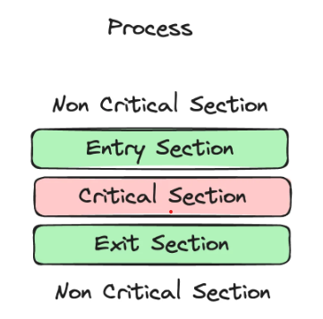

# 항해 플러스 3주차. e-커머스

## 프로젝트 정보
- Java 17
- SpringBoot 3.3.4
- JUnit + AssertJ
- Layered + Clean Architecture
- MySQL 8.0
- Swagger (http://localhost:8080/swagger-ui/index.html)

## 목차

### `Step05`
1. [시나리오 선정](#1-시나리오-선정-e-커머스-서비스)
2. [Milestone](#2-Milestone)
3. [시퀀스 다이어그램](#3-시퀀스-다이어그램)

### `Step06`
1. [ERD 설계](#1-erd-설계)
2. [API 명세 및 MockAPI](#2-api-명세-및-mockapi)

### `Step07`
1. [Swagger](#1-erd-설계)

### `Step09`
1. [Chapter02 회고](#1-chapter02-회고)

### `Step11`
1. [동시성 문제에 대한 고찰](#동시성-문제에-대한-고찰)
---

## `Step5`
## 1. 시나리오 선정: `e-커머스 서비스`
<details>
<summary>요구사항 보기</summary>

### Description
- `e-커머스 상품 주문 서비스`를 구현해 봅니다.
- 상품 주문에 필요한 메뉴 정보들을 구성하고 조회가 가능해야 합니다.
- 사용자는 상품을 여러개 선택해 주문할 수 있고, 미리 충전한 잔액을 이용합니다.
- 상품 주문 내역을 통해 판매량이 가장 높은 상품을 추천합니다.

### Requirements
- 아래 4가지 API 를 구현합니다.
    - 잔액 충전 / 조회 API
    - 상품 조회 API
    - 주문 / 결제 API
    - 인기 판매 상품 조회 API
- 각 기능 및 제약사항에 대해 단위 테스트를 반드시 하나 이상 작성하도록 합니다.
- 다수의 인스턴스로 어플리케이션이 동작하더라도 기능에 문제가 없도록 작성하도록 합니다.
- `동시성 이슈`를 고려하여 구현합니다.
- 재고 관리에 문제 없도록 구현합니다.

### API Specs

`기본 과제`

1️⃣ `주요` 잔액 충전 / 조회 API
- 결제에 사용될 금액을 충전하는 API 를 작성합니다.
- 사용자 식별자 및 충전할 금액을 받아 잔액을 충전합니다.
- 사용자 식별자를 통해 해당 사용자의 잔액을 조회합니다.

2️⃣ `기본` 상품 조회 API
- 상품 정보(ID, 이름, 가격, 잔여수량)을 조회하는 API 를 작성합니다.
- 조회 시점의 상품별 잔여수량이 정확하면 좋습니다.

3️⃣ `주요` 주문 / 결제 API
- 사용자 식별자와 (상품 ID, 수량) 목록을 입력받아 주문하고 결제를 수행하는 API 를 작성합니다.
- 결제는 기 충전된 잔액을 기반으로 수행하며 성공할 시 잔액을 차감해야 합니다.
- 데이터 분석을 위해 결제 성공 시에 실시간으로 주문 정보를 데이터 플랫폼에 전송해야 합니다.
  - 데이터 플랫폼이 어플리케이션 `외부` 라는 가정만 지켜 작업해 주시면 됩니다.
  - 데이터 플랫폼으로의 전송 기능은 Mock API, Fake Module 등 다양한 방법으로 접근해 봅니다.

4️⃣ `기본` 상위 상품 조회 API
- 최근 3일간 가장 많이 팔린 상위 5개 상품 정보를 제공하는 API 를 작성합니다.
- 통계 정보를 다루기 위한 기술적 고민을 충분히 해보도록 합니다.

`심화 과제`

5️⃣ `심화` 장바구니 기능
- 사용자는 구매 이전에 관심 있는 상품들을 장바구니에 적재할 수 있습니다.
- 이 기능을 제공하기 위해 `장바구니에 상품 추가/삭제` API 와 `장바구니 조회` API 가 필요합니다.
- 위 두 기능을 제공하기 위해 어떤 요구사항의 비즈니스 로직을 설계해야 할지 고민해 봅니다.

`💡KEY POINT`

- 동시에 여러 주문이 들어올 경우, 유저의 보유 잔고에 대한 처리가 정확해야 합니다.
- 각 상품의 재고 관리가 정상적으로 이루어져 잘못된 주문이 발생하지 않도록 해야 합니다.

</details>

## 2. Milestone
<details>
<summary>내용 보기</summary>

### 1주차 (2024년 10월 05일 ~ 2024년 10월 11일)
- `주요 목표`: 프로젝트 시작 및 기본 API 설계
- `작업 내용`
  - Milestone 작성
  - 시퀀스 다이어그램 작성
  - ERD 작성
  - API 명세 및 MockAPI 작성

### 2주차 (2024년 10월 12일 ~ 2024년 10월 18일)
- `주요 목표`: 기능 구현
- `작업 내용`
  - 잔액 충전 / 조회 API 구현
  - 상품 조회 API / 상위 상품 조회 API 구현
  - 주문 / 결제 API 구현
  - 장바구니 기능 구현

### 3주차 (2024년 10월 19일 ~ 2024년 10월 25일)
- `주요 목표`: 기능 고도화 및 리팩토링
- `작업 내용`
  - 코드 리팩토링 및 최적화
  - 예외 처리 강화
  - 통합 테스트 작성

</details>

## 3. 시퀀스 다이어그램
<details>
<summary>내용 보기</summary>

### ver. 1주차 (2024년 10월 05일 ~ 2024년 10월 11일)
- 클라이언트, 도메인 모듈, 데이터 플랫폼을 기본 구조로 시퀀스 다이어그램을 작성 
- 추후 과제 요구사항에 맞춰 점차 고도화 예정
- Mermaid 로딩 문제로 인한 다이어그램 통합

### ver. 2주차 (2024년 10월 12일 ~ 2024년 10월 18일)
- 과제 피드백 수정 사항 반영: 서비스명 및 메서드명 표기
- 비지니스 로직 구현에 따른 변경


</details>

## `Step6`

## 1. ERD 설계

<details>
<summary>내용 보기</summary>

### ver. 1주차 (2024년 10월 05일 ~ 2024년 10월 11일)
- 히스토리 테이블 제외
- 추후 과제 요구사항에 맞춰 점차 고도화 예정

### ver. 2주차 (2024년 10월 12일 ~ 2024년 10월 18일)
- 과제 피드백 수정 사항 반영


</details>

## 2. API 명세 및 MockAPI

<details>
<summary>내용 보기</summary>

### (1) 잔액 조회 API
- Endpoint: `GET` /users/balance/{id}
- Summary: 사용자의 잔액을 조회한다.
- Parameter:
  - `id` 사용자 고유 식별자
- ResponseBody:
  - `200` OK
    - `userId`: 사용자 고유 식별자
    - `userName`: 사용자 이름
    - `point`: 포인트 잔액
  ```json
  {
    "userId": "long",
    "userName": "string",
    "point": "long"
  }
  ```
- Example:
  - Response:
    ```json
    {
      "userId": 1,
      "userName": "Alice",
      "point": 100000
    }
    ```
    
### (2) 잔액 충전 API
- Endpoint: `PATCH` /users/balance/charge
- Summary: 사용자의 잔액을 충전한다.
- RequestBody:
  - `userId`: 사용자 고유 식별자
  - `amount`: 충전할 금액
  ```json
  {
    "userId": "long",
    "amount": "long"
  }
  ```
- ResponseBody:
  - `200` OK
    - `userId`: 사용자 고유 식별자
    - `userName`: 사용자 이름
    - `point`: 포인트 잔액
  ```json
  {
    "userId": "long",
    "userName": "string",
    "point": "long"
  }
  ```
- Example:
  - Request:
    ```json
    {
      "userId": 1,
      "amount": 500000
    }
    ``` 
  - Response:
    ```json
    {
       "userId": 1,
       "userName": "Alice",
       "point": 150000
    }
    ```

### (3) 상품 목록 조회 API
- Endpoint: `GET` /products
- Summary: 상품 목록을 조회한다.
- ResponseBody:
  - `200` OK
    - `productId`: 상품 고유 식별자
    - `productName`: 상품명
    - `unitPrice`: 단가
    - `stock`: 재고 수량
  ```json
  [
    {
      "productId": "long",
      "ProductName": "string",
      "unitPrice": "long",
      "stock": "long"
    }
  ]
  ```
- Example:
- Response:
  ```json
  [
    {
      "productId": 1,
      "ProductName": "Laptop",
      "unitPrice": 1500000,
      "stock": 10
    },
    {
      "productId": 2,
      "ProductName": "Smartphone",
      "unitPrice": 800000,
      "stock": 20
    },
    {
      "productId": 3,
      "ProductName": "Headphones",
      "unitPrice": 150000,
      "stock": 50
    },
    {
      "productId": 4,
      "ProductName": "Keyboard",
      "unitPrice": 50000,
      "stock": 30
    },
    {
      "productId": 5,
      "ProductName": "Mouse",
      "unitPrice": 30000,
      "stock": 40
    },
    {
      "productId": 6,
      "ProductName": "Monitor",
      "unitPrice": 300000,
      "stock": 15
    },
    {
      "productId": 7,
      "ProductName": "Tablet",
      "unitPrice": 600000,
      "stock": 25
    },
    {
      "productId": 8,
      "ProductName": "Smartwatch",
      "unitPrice": 250000,
      "stock": 35
    },
    {
      "productId": 9,
      "ProductName": "External Hard Drive",
      "unitPrice": 120000,
      "stock": 20
    },
    {
      "productId": 10,
      "ProductName": "USB Cable",
      "unitPrice": 10000,
      "stock": 100
    }
  ]
  ```

### (4) 상위 상품 조회 API
- Endpoint: `GET` /products/popular
- Summary: 최근 3일간 가장 많이 팔린 상위 5개 상품을 조회한다.
- ResponseBody:
  - `200` OK
    - `productId`: 상품 고유 식별자
    - `productName`: 상품명
    - `unitPrice`: 단가
    - `stock`: 재고 수량
  ```json
  [
    {
      "productId": "long",
      "ProductName": "string",
      "unitPrice": "long",
      "stock": "long"
    }
  ]
  ```
- Example:
  - Response:
    ```json
    [
      {
        "productId": 4,
        "ProductName": "Keyboard",
        "unitPrice": 50000,
        "stock": 30
      },
      {
        "productId": 2,
        "ProductName": "Smartphone",
        "unitPrice": 800000,
        "stock": 20
      },
      {
        "productId": 1,
        "ProductName": "Laptop",
        "unitPrice": 1500000,
        "stock": 10
      },
      {
        "productId": 7,
        "ProductName": "Tablet",
        "unitPrice": 600000,
        "stock": 25
      },
      {
        "productId": 10,
        "ProductName": "USB Cable",
        "unitPrice": 10000,
        "stock": 100
      }
    ]
    ```

### (5) 주문 API
- Endpoint: `POST` /orders
- Summary: 상품을 주문한다.
- RequestBody:
  - `userId`: 사용자 고유 식별자
  - `OrderProductList`: 주문 상품 리스트
    - `productId`: 상품 고유 식별자
    - `quantity`: 주문 수량 
  ```json
  {
    "userId": "long",
    "OrderProductList": [
      {
        "productId": "long",
        "quantity": "long"
      }
    ]
  }
  ```
- ResponseBody:
  - `200` OK
    - `orderId`: 주문 고유 식별자
    - `orderStatus`: 주문 상태 (PENDING: 주문 대기, COMPLETED: 주문 완료, CANCELED: 주문 취소)
    - `productCount`: 주문 상품 수량
    - `totalPrice`: 주문 금액
    ```json
    {
      "orderId": "long",
      "orderStatus": "string",
      "productCount": "long",
      "totalPrice": "long"
    }
    ```
- Example:
  - Request:
    ```json
    {
      "userId":1,
      "OrderProductList": [
        {
          "productId": 2,
          "quantity": 3
        }
      ]
    }
    ``` 
  - Response:
    ```json
    {
      "orderId": 11,
      "orderStatus": "PENDING",
      "productCount": 1,
      "totalPrice": 2400000
    }
    ```

### (6) 결제 API
- Endpoint: `POST` /payments
- Summary: 주문을 결제한다.
- RequestBody:
  - `userId`: 사용자 고유 식별자
  - `orderId`: 주문 고유 식별자
  ```json
  {
    "userId": "long",
    "orderId": "long"
  }
  ```
- ResponseBody:
  - `200` OK
    - `paymentTsid`: 결제 고유 식별자
    - `amount`: 결제 금액
    - `status`: 결제 상태 (SUCCESS: 결제 성공, FAILED: 결제 실패, CANCELLED: 결제 취소)
    ```json
    {
      "paymentId": "long",
      "amount" : "long",
      "paymentStatus" : "string"
    }
    ```
- Example:
  - Request:
    ```json
    {
      "userId": 1,
      "orderId": 11
    }
    ``` 
  - Response:
    ```json
    {
      "paymentId": 1,
      "amount": 2400000,
      "paymentStatus": "FAILED"
    }
    ```

### (7) 장바구니 목록 조회 API
- Endpoint: `GET` /carts/{id}
- Summary: 장바구니 목록을 조회한다.
- Parameter:
  - `id` 사용자 고유 식별자
- ResponseBody:
  - `200` OK
    - `productId`: 장바구니 고유 식별자
    - `productName`: 상품명
    - `quantity`: 장바구니 상품 수량
    - `unitPrice`: 장바구니 상품 단가
    - `cartState`: 장바구니 상품 상태 (AVAILABLE: 구매 가능, OUT_OF_STOCK: 품절)
  ```json
  [
    {
      "productId": "long",
      "productName": "string",
      "quantity": "long",
      "unitPrice": "long",
      "cartState": "string"
    }
  ]
  ```
- Example:
  - Response:
    ```json
    [
      {
        "productId": 1,
        "productName": "Laptop",
        "quantity": 1,
        "unitPrice": 1500000,
        "cartState": "AVAILABLE"
      }
    ]
    ```

### (8) 장바구니 추가 API
- Endpoint: `PATCH` /carts/add
- Summary: 장바구니에 상품을 추가한다.
- RequestBody:
  - `userId`: 사용자 고유 식별자
  - `productId`: 상품 고유 식별자
  - `quantity`: 장바구니 상품 추가 수량
  ```json
  {
    "userId": "long",
    "productId": "long",
    "quantity": "long"
  }
  ```
- ResponseBody:
  - `200` OK
    - `productId`: 장바구니 고유 식별자
    - `productName`: 상품명
    - `quantity`: 장바구니 상품 수량
    - `unitPrice`: 장바구니 상품 단가
    - `cartState`: 장바구니 상품 상태 (AVAILABLE: 구매 가능, OUT_OF_STOCK: 품절)
  ```json
  [
    {
      "productId": "long",
      "productName": "string",
      "quantity": "long",
      "unitPrice": "long",
      "cartState": "string"
    }
  ]
  ```
- Example:
  - Request:
    ```json
    {
      "userId": 1,
      "productId": 1,
      "quantity": 1
    }
    ``` 
  - Response:
    ```json
    [
      {
        "productId": 1,
        "productName": "Laptop",
        "quantity": 1,
        "unitPrice": 1500000,
        "cartState": "AVAILABLE"
      }
    ]
    ```
    
### (9) 장바구니 제거 API
- Endpoint: `PATCH` /carts/remove
- Summary: 장바구니의 상품을 제거한다.
- RequestBody:
  - `userId`: 사용자 고유 식별자
  - `productId`: 상품 고유 식별자
  ```json
  {
    "userId": "long",
    "productId": "long"
  }
  ```
- ResponseBody:
  - `200` OK
    - `productId`: 장바구니 고유 식별자
    - `productName`: 상품명
    - `quantity`: 장바구니 상품 수량
    - `unitPrice`: 장바구니 상품 단가
    - `cartState`: 장바구니 상품 상태 (AVAILABLE: 구매 가능, OUT_OF_STOCK: 품절)
  ```json
  [
    {
      "productId": "long",
      "productName": "string",
      "quantity": "long",
      "unitPrice": "long",
      "cartState": "string"
    }
  ]
  ```
- Example:
  - Request:
    ```json
    {
      "userId": 1,
      "productId": 1
    }
    ``` 
  - Response:
    ```json
    [
      {
        "productId": 1,
        "productName": "Laptop",
        "quantity": 1,
        "unitPrice": 1500000,
        "cartState": "AVAILABLE"
      }
    ]
    ```
    
</details>

## `Step7`
## 1. Swagger
<details>
<summary>내용 보기</summary>

### Swagger: http://localhost:8080/swagger-ui/index.html


</details>

## `Step9`
## 1. Chapter02 회고
<details>
<summary>내용 보기</summary>

### 1주차 (2024년 10월 05일 ~ 2024년 10월 11일)
프로젝트의 첫 주는 전체적인 방향을 잡는 데 중점을 두었습니다.
시퀀스 다이어그램과 ERD 작성은 비즈니스 로직을 시각적으로 표현하는 데 도움이 되었으며, 명세와 MockAPI 작성을 통해 각 엔드포인트의 역할을 명확히 할 수 있었습니다.
이 과정에서 느낀 점은 초기 설계에 시간을 투자하는 것이 이후 개발의 효율성을 높인다는 것이었습니다. 설계의 중요성을 실감한 주차였습니다.

### 2주차 (2024년 10월 12일 ~ 2024년 10월 18일)
본격적인 기능 구현이 이루어진 주차였습니다.
초기에 설계한 API 명세를 바탕으로 빠르게 개발을 진행할 수 있었지만, 일부 예외 처리 및 경계 조건을 고려하지 못했던 부분에서 시간이 지체되기도 했습니다.
특히, 장바구니와 주문/결제 API에서 비즈니스 로직의 복잡성을 느꼈고, 초기 설계 시 좀 더 구체적인 시나리오를 고려했으면 좋았겠다고 생각했습니다.
이 경험은 설계 단계에서 예외 상황과 경계 조건에 대해 더 깊이 고민해야 함을 깨닫게 해주었습니다.

### 3주차 (2024년 10월 19일 ~ 2024년 10월 25일)
이번 주는 기능을 고도화하고 기존 코드를 개선하는 데 집중했습니다.
초기 설계와 구현된 코드를 기반으로 리팩토링을 진행하며 코드의 가독성과 유지보수성을 높이는 데 주력했습니다. 
통합 테스트 작성은 시스템의 안정성을 확인하는 중요한 과정이었고, 초기 설계와 명세가 잘 되어 있어서 테스트 시 큰 문제가 발생하지 않았습니다.
이 과정에서 다시 한 번 설계가 중요하다는 것을 실감했고, 설계에 더 많은 시간을 투자하는 것이 개발 과정에서의 리스크를 줄이는 데 크게 기여한다는 결론을 내렸습니다.

### 전체적인 회고
설계가 제대로 되어 있다면, 개발 속도는 자연스럽게 빨라지고 리팩토링 시에도 큰 어려움이 없습니다.
설계 단계에서 충분한 시간과 자원을 투자하면, 이후의 개발 과정에서 발생할 수 있는 문제를 미연에 방지할 수 있습니다.
이번 챕터 통해 설계의 중요성을 더욱 깊이 느낄 수 있었으며, 앞으로의 프로젝트에서도 초기 설계에 더 집중하고자 합니다.

</details>

## `Step11`
## 동시성 문제에 대한 고찰
<details>
<summary>내용 보기</summary>

## 동시성 문제(Concurrency Issue)

여러 프로세스나 스레드가 동시에 같은 데이터에 접근하려 할 때 데이터의 일관성을 해칠 수 있는 상황을 말한다.

`동시성 문제`와 함께 확인해야 할 개념이 있다. 

### 공유 자원(Shared Resource)

`공유 자원`은 여러 프로세스나 스레드가 접근할 수 있는 자원을 말한다.

### 경쟁 상태(Race Condition)

`경쟁 상태`는 `공유 자원`을 동시에 읽거나 쓰는 경우 발생할 수 있는 상황으로, `공유 자원`에 접근하는 순서와 타이밍에 따라 실행 결과가 달라지며, 데이터의 일관성이 보장되지 않는 문제가 발생한다. 

`Example` 입출금 문제


- `Thread-1`과 `Thread-2`는 동시에 계좌 잔액 1,000원을 조회한다.
- `Thread-1`은 500원을 입금하여 계좌 잔액을 1,500원으로 저장한다.
- `Thread-2`는 500원을 인출하여 계좌 잔액을 500원으로 저장한다.

계좌 잔액이 1,000원인 상황에서 `Thread-1`이 500원을 입금하고 `Thread-2`가 500원을 출금한다면 계좌 잔액은 1,000원이어야 한다. 그러나, `공유 자원`인 계좌 잔액에 대해 `Thread-1`과 `Thread-2` 사이에서 `경쟁 상태`가 발생할 수 있으며 최종 계좌 잔액은 1,000원이 아닐 가능성이 있다.

그렇다면 이러한 상황은 왜 발생하는 것일까?

바로, `원자성(Atomicity)`과 `가시성(Visibility)`이 보장되지 않았기 때문이다.

`원자성`은 하나의 작업이 중간에 끼어들거나 나누어지지 않고, 완전히 실행되거나 전혀 실행되지 않아야 함을 말한다. 즉, 계좌 잔액을 조회하고 값을 변경한 후, 변경된 값을 저장하는 것이 모두 하나의 단위 작업으로 실행 되어야 한다.

`가시성`은 하나의 프로세스나 스레드가 수정한 값을 다른 프로세스나 스레드가 즉시 확인할 수 있어야 함을 의미한다. 위 그림과 같이, `Thread-1`이 변경한 계좌 잔액이 `Thread-2`에 반영되지 않아 데이터의 일관성이 깨질 수 있다.

### 임계 영역(Critical Section)



(출처: https://nailyourinterview.org/interview-resources/operating-systems/critical-section-problem/)

`공유 자원`에 접근하는 영역을 `임계 영역`이라고 하며, `경쟁 상태`가 발생하는 영역이다.

`임계 영역`에서 `동기화 기법`을 통해 `경쟁 상태`를 해결할 수 있으며, 설계시 고려해야 할 조건이 있다. 

1. `상호 배제(Mutual Exclusion)`: 임계 영역에 동시에 하나의 프로세스나 스레드만 접근할 수 있도록 보장하는 특성을 말한다.
2. `진행(Progress)`: 임계 영역에 진입하려는 스레드가 하나라도 있을 경우, 다른 스레드가 해당 진입을 방해하지 않도록 보장하는 특성을 말한다.
3. `한정 대기(Bounded Waiting)`: 스레드가 임계 영역에 들어가기 위해 무한히 기다리지 않도록 보장하는 특성을 말한다.

`동기화 기법`에는 대표적으로 `lock`, `synchronized`키워드를 활용하는 방법이 있으며, `Chapter01. TDD & Clean Architecture`에서 학습했던 내용이다.

이번 과제에서는 데이터베이스에서 발생할 수 있는 동시성 문제를 파악하고 해결해보고자 한다.

## 데이터베이스의 동시성 문제

다수의 사용자가 동시에 데이터베이스에 접근하여 동일한 데이터를 조회하거나 수정하는 상황이 발생한다.

이때, 발생할 수 있는 동시성 문제는 아래와 같다.

### 갱신 분실(Lost Update)

`갱신 분실`은 여러 트랜잭션이 동시에 데이터를 수정하면서 하나의 트랜잭션 작업의 결과가 분신되는 문제를 말한다.


- `Transaction1`이 상품 재고(10개)를 조회한다. 
- `Transaction2`도 상품 재고(10개)를 조회한다.
- `Transaction1`이 상품 재고를 20개로 업데이트한다.
- `Transaction2`도 상품 재고를 5개로 업데이트한다.

`Transaction1`의 업데이트가 `Transaction2`의 업데이트에 의해 분실되는 상황이 발생한다.

### 모순성(Inconsistency)


## 데이터베이스의 동시성 문제 해결 방안

그렇다면, 동시성 문제를 해결할 수 있는 방법은 무엇이 있을까?


## 이커머스 과제에서의 동시성 문제 해결 

동시성 문제를 해결하기 위해 `Database Lock`과 `Redis`를 활용한 `Distributed Lock` 등 다양한 동시성 제어 기법을 활용한다.

다양한 동시성 제어 기법을 비교한 후, 적절한 동시성 기법을 활용하여 이번 과제에서 발생할 수 있는 동시성 문제를 해결해보고자 한다.

동시성 제어 기법을 비교하기 위해 아래와 같이 테스트 시나리오를 작성하였으며, `JMeter`를 활용하여 다양한 지표를 비교하였다.

```
[시나리오]

최초 재고가 6000개인 특정 상품(Laptop)에 대해 아래와 같이 요청을 보낸다.

100명의 사용자가 동시에 재고 1개 차감 요청
1000명의 사용자가 동시에 재고 1개 차감 요청
5000명의 사용자가 동시에 재고 1개 차감 요청
```

테스트를 위해 구현한 재고 차감 로직은 아래와 같다.

```java
@Transactional
public Product reduceProduct(long productId, long quantity) {
    
    // 01. 재고 조회 
	Product product = productRepository.findById(productId)
			.orElseThrow(() -> new IllegalStateException(ExceptionMessage.PRODUCT_NOT_FOUND.getMessage()));
    
    // 02. 재고 차감
	product.reduceStock(quantity);

    // 03. 저장
	return productRepository.save(product);
}
```

### CASE01. 트랜잭션 격리 수준

현재 데이터베이스에 설정된 트랜잭션 격리 수준을 확인하기 위해 쿼리문 `SELECT @@GLOBAL(or SESSION).transaction_isolation`을 실행하였다.


InnoDB의 기본값인 `REPEATABLE_READ`로 설정되어 있는 것을 확인할 수 있었다.


</details>